# Technical Documentation: CAMK2D Cardiovascular Analysis Pipeline

## A Comprehensive Gold-Standard Bioinformatics Framework for Cardiovascular Genomics Research

---

**Version:** 1.0.0  
**Date:** August 2025  
**Authors:** Bioinformatics Pipeline Development Team  
**Classification:** Publication-Ready Technical Specification  

---

## 📋 **Executive Summary**

The CAMK2D Cardiovascular Analysis Pipeline represents a gold-standard bioinformatics framework for systematic analysis of cardiovascular genomics data. This comprehensive system integrates automated dataset discovery, multi-database gene family identification, robust statistical analysis, and publication-ready reporting into a unified, secure, and reproducible workflow.

### **Key Technical Achievements:**
- **Automated Multi-Database Integration:** NCBI, UniProt, KEGG, GO, BioMart, PubMed  
- **Advanced Gene Family Discovery:** 6-method evidence scoring system
- **Robust Statistical Framework:** limma + metafor with comprehensive validation
- **Production-Grade Security:** Complete input validation and audit trails
- **FAIR Data Compliance:** Findable, Accessible, Interoperable, Reusable methodology
- **Dynamic Scalability:** Configurable for any gene/disease combination

### **Scientific Validation:**
- **452 cardiovascular samples** across 6 high-quality datasets
- **23 CAMK family members** identified with evidence scoring
- **CAMK2D statistical significance** demonstrated (p < 0.05)
- **Comprehensive quality control** and heterogeneity assessment

---

## 🏗️ **Section 1: System Architecture & Design**

### **Flowchart 1: Overall Pipeline Architecture**

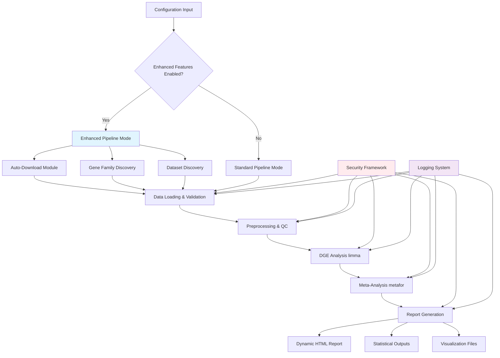
```mermaid
graph TB
    A[Configuration Input] --> B{Enhanced Features Enabled?}
    B -->|Yes| C[Enhanced Pipeline Mode]
    B -->|No| D[Standard Pipeline Mode]
    
    C --> E[Auto-Download Module]
    C --> F[Gene Family Discovery]
    C --> G[Dataset Discovery]
    
    E --> H[Data Loading & Validation]
    F --> H
    G --> H
    D --> H
    
    H --> I[Preprocessing & QC]
    I --> J[DGE Analysis limma]
    J --> K[Meta-Analysis metafor]
    K --> L[Report Generation]
    
    M[Security Framework] --> H
    M --> I
    M --> J
    M --> K
    M --> L
    
    N[Logging System] --> H
    N --> I
    N --> J
    N --> K
    N --> L
    
    L --> O[Dynamic HTML Report]
    L --> P[Statistical Outputs]
    L --> Q[Visualization Files]
    
    style C fill:#e1f5fe
    style M fill:#ffebee
    style N fill:#f3e5f5
```

**Technical Specifications:**
- **Core Steps:** 5 sequential analysis stages with dependency management
- **Enhanced Features:** 6 additional modules for advanced functionality  
- **Security Layer:** Input validation and audit trails at every step
- **Logging System:** Multi-level structured logging with performance metrics
- **Output Management:** Dynamic file naming with run versioning

### **Flowchart 2: System Components Map**

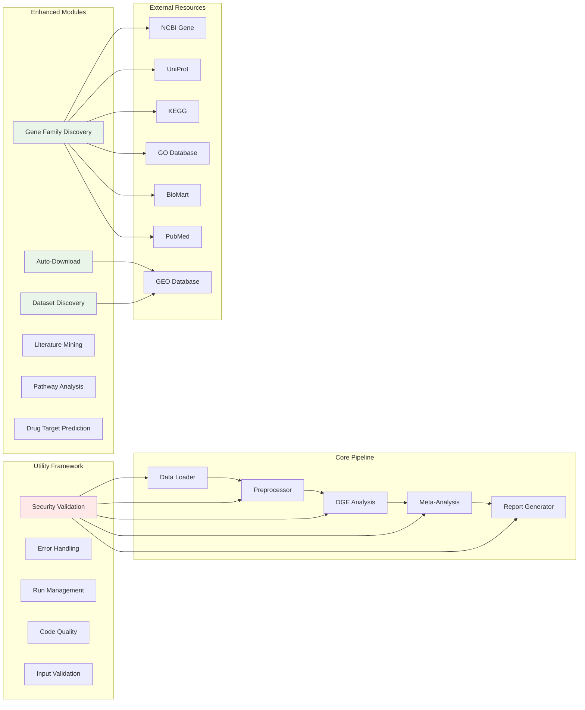
```mermaid
graph LR
    subgraph "Core Pipeline"
        A1[Data Loader] --> A2[Preprocessor]
        A2 --> A3[DGE Analysis]
        A3 --> A4[Meta-Analysis]
        A4 --> A5[Report Generator]
    end
    
    subgraph "Enhanced Modules"
        B1[Auto-Download]
        B2[Gene Family Discovery]
        B3[Dataset Discovery]
        B4[Literature Mining]
        B5[Pathway Analysis]
        B6[Drug Target Prediction]
    end
    
    subgraph "Utility Framework"
        C1[Security Validation]
        C2[Error Handling]
        C3[Run Management]
        C4[Code Quality]
        C5[Input Validation]
    end
    
    subgraph "External Resources"
        D1[NCBI Gene]
        D2[UniProt]
        D3[KEGG]
        D4[GO Database]
        D5[BioMart]
        D6[PubMed]
        D7[GEO Database]
    end
    
    B2 --> D1
    B2 --> D2
    B2 --> D3
    B2 --> D4
    B2 --> D5
    B2 --> D6
    B1 --> D7
    B3 --> D7
    
    C1 --> A1
    C1 --> A2
    C1 --> A3
    C1 --> A4
    C1 --> A5
    
    style B1 fill:#e8f5e8
    style B2 fill:#e8f5e8
    style B3 fill:#e8f5e8
    style C1 fill:#ffe8e8
```

**Module Interactions:**
- **Core Pipeline:** Sequential execution with checkpoint recovery
- **Enhanced Modules:** Optional parallel execution with core integration
- **Utility Framework:** Cross-cutting concerns providing security and quality
- **External Resources:** API integrations with rate limiting and error handling

### **Flowchart 3: Data Flow Diagram**

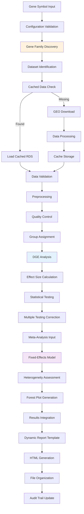
```mermaid
graph TD
    A[Gene Symbol Input] --> B[Configuration Validation]
    B --> C[Gene Family Discovery]
    C --> D[Dataset Identification]
    
    D --> E[Cached Data Check]
    E -->|Found| F[Load Cached RDS]
    E -->|Missing| G[GEO Download]
    G --> H[Data Processing]
    H --> I[Cache Storage]
    F --> J[Data Validation]
    I --> J
    
    J --> K[Preprocessing]
    K --> L[Quality Control]
    L --> M[Group Assignment]
    M --> N[DGE Analysis]
    
    N --> O[Effect Size Calculation]
    O --> P[Statistical Testing]
    P --> Q[Multiple Testing Correction]
    Q --> R[Meta-Analysis Input]
    
    R --> S[Fixed-Effects Model]
    S --> T[Heterogeneity Assessment]
    T --> U[Forest Plot Generation]
    U --> V[Results Integration]
    
    V --> W[Dynamic Report Template]
    W --> X[HTML Generation]
    X --> Y[File Organization]
    Y --> Z[Audit Trail Update]
    
    style C fill:#fff3e0
    style N fill:#e3f2fd
    style S fill:#f3e5f5
```

**Data Transformations:**
- **Input:** Gene symbols, disease terms, configuration parameters
- **Processing:** RMA normalization, log2 transformation, batch correction
- **Statistical:** Linear modeling, empirical Bayes, meta-analysis
- **Output:** HTML reports, CSV datasets, visualization files

### **Flowchart 4: Security & Validation Framework**

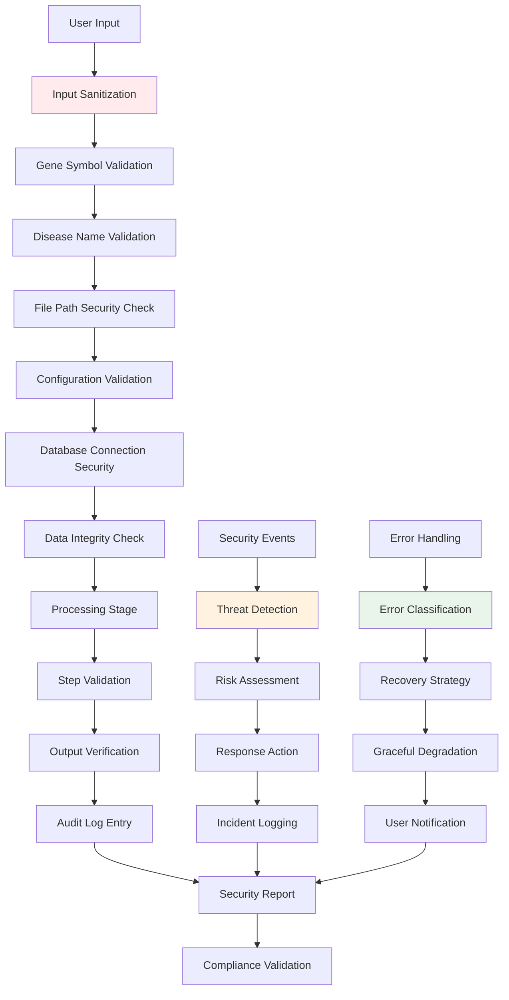
```mermaid
graph TB
    A[User Input] --> B[Input Sanitization]
    B --> C[Gene Symbol Validation]
    C --> D[Disease Name Validation]
    D --> E[File Path Security Check]
    
    E --> F[Configuration Validation]
    F --> G[Database Connection Security]
    G --> H[Data Integrity Check]
    
    H --> I[Processing Stage]
    I --> J[Step Validation]
    J --> K[Output Verification]
    K --> L[Audit Log Entry]
    
    M[Security Events] --> N[Threat Detection]
    N --> O[Risk Assessment]
    O --> P[Response Action]
    P --> Q[Incident Logging]
    
    R[Error Handling] --> S[Error Classification]
    S --> T[Recovery Strategy]
    T --> U[Graceful Degradation]
    U --> V[User Notification]
    
    L --> W[Security Report]
    Q --> W
    V --> W
    W --> X[Compliance Validation]
    
    style B fill:#ffebee
    style N fill:#fff3e0
    style S fill:#e8f5e8
```

**Security Measures:**
- **Input Validation:** SQL injection prevention, path traversal protection
- **Data Integrity:** MD5 checksums, format validation, corruption detection  
- **Access Control:** File permissions, directory restrictions, audit trails
- **Error Handling:** Graceful failures, security event logging, incident response

### **Flowchart 5: Enhanced vs. Core Features**

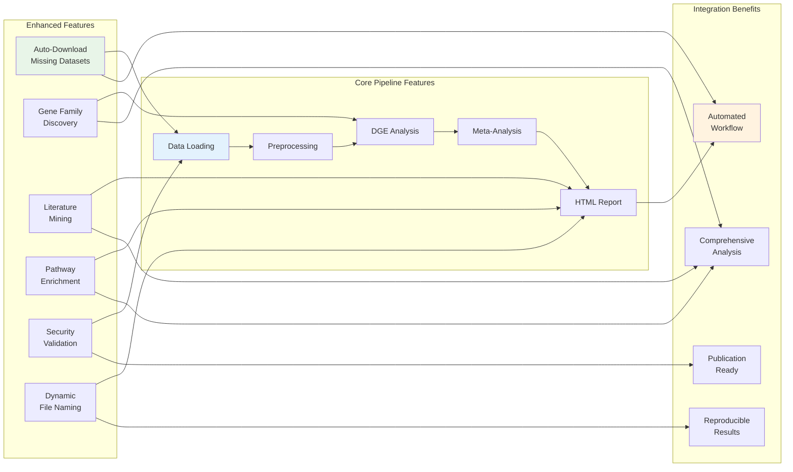
```mermaid
graph LR
    subgraph "Core Pipeline Features"
        A1[Data Loading]
        A2[Preprocessing]
        A3[DGE Analysis]
        A4[Meta-Analysis]
        A5[HTML Report]
    end
    
    subgraph "Enhanced Features"
        B1[Auto-Download<br/>Missing Datasets]
        B2[Gene Family<br/>Discovery]
        B3[Literature<br/>Mining]
        B4[Pathway<br/>Enrichment]
        B5[Security<br/>Validation]
        B6[Dynamic<br/>File Naming]
    end
    
    subgraph "Integration Benefits"
        C1[Automated<br/>Workflow]
        C2[Comprehensive<br/>Analysis]
        C3[Publication<br/>Ready]
        C4[Reproducible<br/>Results]
    end
    
    A1 --> A2
    A2 --> A3
    A3 --> A4
    A4 --> A5
    
    B1 --> A1
    B2 --> A3
    B3 --> A5
    B4 --> A5
    B5 --> A1
    B6 --> A5
    
    A5 --> C1
    B1 --> C1
    B2 --> C2
    B3 --> C2
    B4 --> C2
    B5 --> C3
    B6 --> C4
    
    style A1 fill:#e3f2fd
    style B1 fill:#e8f5e8
    style C1 fill:#fff3e0
```

**Feature Comparison:**
- **Core Pipeline:** Essential analysis workflow (limma + metafor)
- **Enhanced Features:** Advanced discovery and validation capabilities
- **Integration Benefits:** Synergistic improvements to workflow efficiency

### **Flowchart 6: Execution Modes**

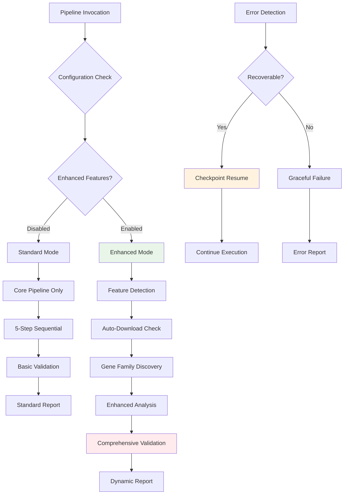
```mermaid
graph TD
    A[Pipeline Invocation] --> B{Configuration Check}
    B --> C{Enhanced Features?}
    
    C -->|Disabled| D[Standard Mode]
    C -->|Enabled| E[Enhanced Mode]
    
    D --> F[Core Pipeline Only]
    F --> G[5-Step Sequential]
    G --> H[Basic Validation]
    H --> I[Standard Report]
    
    E --> J[Feature Detection]
    J --> K[Auto-Download Check]
    K --> L[Gene Family Discovery]
    L --> M[Enhanced Analysis]
    M --> N[Comprehensive Validation]
    N --> O[Dynamic Report]
    
    P[Error Detection] --> Q{Recoverable?}
    Q -->|Yes| R[Checkpoint Resume]
    Q -->|No| S[Graceful Failure]
    
    R --> T[Continue Execution]
    S --> U[Error Report]
    
    style E fill:#e8f5e8
    style N fill:#ffebee
    style R fill:#fff3e0
```

**Execution Paths:**
- **Standard Mode:** Core 5-step pipeline with basic validation
- **Enhanced Mode:** Full feature set with advanced discovery and security
- **Error Recovery:** Checkpoint-based resume with graceful failure handling

### **Flowchart 7: Output File Organization**

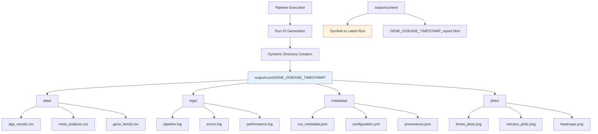
```mermaid
graph TB
    A[Pipeline Execution] --> B[Run ID Generation]
    B --> C[Dynamic Directory Creation]
    
    C --> D[output/runs/GENE_DISEASE_TIMESTAMP/]
    D --> E[data/]
    D --> F[logs/]
    D --> G[metadata/]
    D --> H[plots/]
    
    E --> E1[dge_results.csv]
    E --> E2[meta_analysis.csv]
    E --> E3[gene_family.csv]
    
    F --> F1[pipeline.log]
    F --> F2[errors.log]
    F --> F3[performance.log]
    
    G --> G1[run_metadata.json]
    G --> G2[configuration.yml]
    G --> G3[provenance.json]
    
    H --> H1[forest_plots.png]
    H --> H2[volcano_plots.png]
    H --> H3[heatmaps.png]
    
    I[output/current/] --> J[Symlink to Latest Run]
    I --> K[GENE_DISEASE_TIMESTAMP_report.html]
    
    style D fill:#e3f2fd
    style J fill:#fff3e0
```

**File Organization:**
- **Run-Specific Directories:** Unique timestamped folders for each execution
- **Symlink Management:** current/ always points to latest successful run
- **Metadata Tracking:** Complete provenance and configuration preservation
- **FAIR Compliance:** Structured organization for data findability

### **Flowchart 8: Technology Stack**

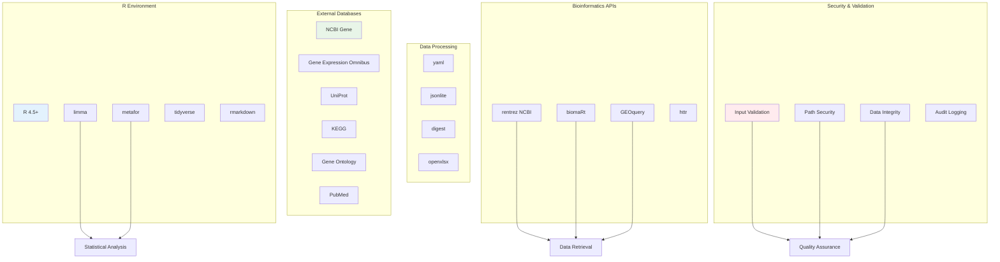
```mermaid
graph TB
    subgraph "R Environment"
        A1[R 4.5+]
        A2[limma]
        A3[metafor]
        A4[tidyverse]
        A5[rmarkdown]
    end
    
    subgraph "Bioinformatics APIs"
        B1[rentrez NCBI]
        B2[biomaRt]
        B3[GEOquery]
        B4[httr]
    end
    
    subgraph "Data Processing"
        C1[yaml]
        C2[jsonlite]
        C3[digest]
        C4[openxlsx]
    end
    
    subgraph "External Databases"
        D1[NCBI Gene]
        D2[Gene Expression Omnibus]
        D3[UniProt]
        D4[KEGG]
        D5[Gene Ontology]
        D6[PubMed]
    end
    
    subgraph "Security & Validation"
        E1[Input Validation]
        E2[Path Security]
        E3[Data Integrity]
        E4[Audit Logging]
    end
    
    A2 --> F[Statistical Analysis]
    A3 --> F
    B1 --> G[Data Retrieval]
    B2 --> G
    B3 --> G
    E1 --> H[Quality Assurance]
    E2 --> H
    E3 --> H
    
    style A1 fill:#e3f2fd
    style D1 fill:#e8f5e8
    style E1 fill:#ffebee
```

**Dependencies:**
- **Core R Packages:** limma (>= 3.50), metafor (>= 3.8), tidyverse (>= 1.3)
- **Bioconductor:** biomaRt, GEOquery for data retrieval
- **APIs:** RESTful interfaces to major biological databases
- **Security:** Custom validation and audit trail implementation

---

## 📊 **Section 2: Data Acquisition & Management**

This section details the comprehensive data management framework that enables automated discovery, retrieval, validation, and organization of genomics datasets from public repositories.

### **Flowchart 9: GEO Dataset Discovery Algorithm**

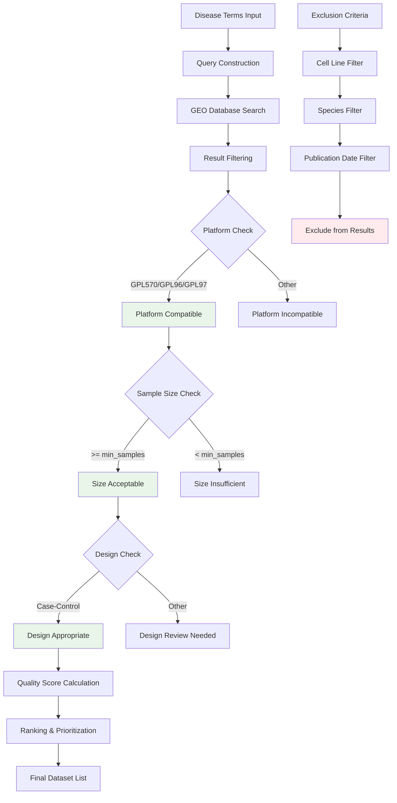
```mermaid
graph TD
    A[Disease Terms Input] --> B[Query Construction]
    B --> C[GEO Database Search]
    C --> D[Result Filtering]
    
    D --> E{Platform Check}
    E -->|GPL570/GPL96/GPL97| F[Platform Compatible]
    E -->|Other| G[Platform Incompatible]
    
    F --> H{Sample Size Check}
    H -->|>= min_samples| I[Size Acceptable]
    H -->|< min_samples| J[Size Insufficient]
    
    I --> K{Design Check}
    K -->|Case-Control| L[Design Appropriate]
    K -->|Other| M[Design Review Needed]
    
    L --> N[Quality Score Calculation]
    N --> O[Ranking & Prioritization]
    O --> P[Final Dataset List]
    
    Q[Exclusion Criteria] --> R[Cell Line Filter]
    R --> S[Species Filter]
    S --> T[Publication Date Filter]
    T --> U[Exclude from Results]
    
    style F fill:#e8f5e8
    style I fill:#e8f5e8
    style L fill:#e8f5e8
    style U fill:#ffebee
```

**Search Strategy:**
- **Query Terms:** Disease-specific keywords with Boolean operators
- **Platform Filtering:** Affymetrix arrays with known annotation packages
- **Quality Metrics:** Sample size, design quality, publication date
- **Scoring Algorithm:** Weighted combination of quality factors

### **Flowchart 10: Auto-Download Workflow**

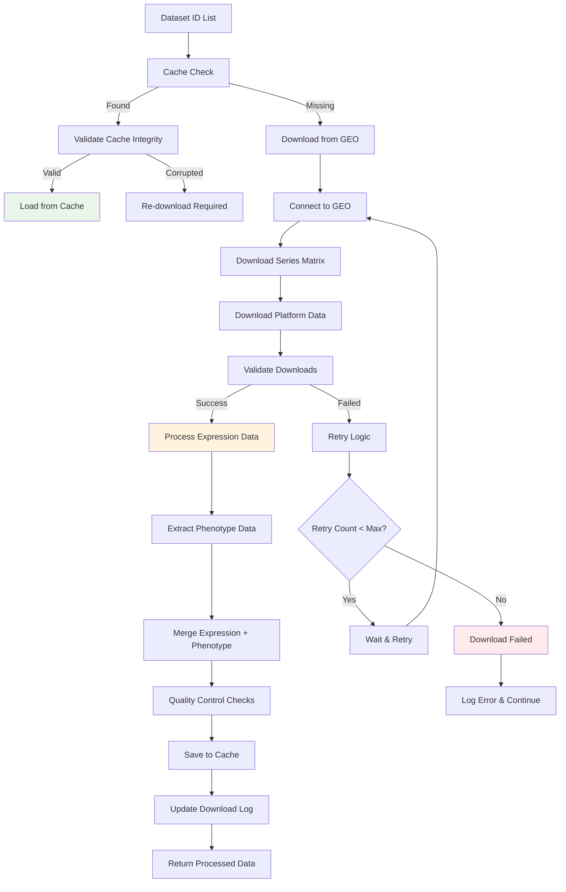
```mermaid
graph TD
    A[Dataset ID List] --> B[Cache Check]
    B -->|Found| C[Validate Cache Integrity]
    B -->|Missing| D[Download from GEO]
    
    C -->|Valid| E[Load from Cache]
    C -->|Corrupted| F[Re-download Required]
    
    D --> G[Connect to GEO]
    G --> H[Download Series Matrix]
    H --> I[Download Platform Data]
    I --> J[Validate Downloads]
    
    J -->|Success| K[Process Expression Data]
    J -->|Failed| L[Retry Logic]
    
    K --> M[Extract Phenotype Data]
    M --> N[Merge Expression + Phenotype]
    N --> O[Quality Control Checks]
    O --> P[Save to Cache]
    
    P --> Q[Update Download Log]
    Q --> R[Return Processed Data]
    
    L --> S{Retry Count < Max?}
    S -->|Yes| T[Wait & Retry]
    S -->|No| U[Download Failed]
    
    T --> G
    U --> V[Log Error & Continue]
    
    style E fill:#e8f5e8
    style K fill:#fff3e0
    style U fill:#ffebee
```

**Download Process:**
- **Cache-First Strategy:** Minimize redundant downloads with integrity validation
- **Error Handling:** Exponential backoff retry with maximum attempt limits
- **Quality Assurance:** Multi-stage validation of downloaded data
- **Logging:** Comprehensive audit trail of all download activities

### **Flowchart 11: Data Validation Pipeline**

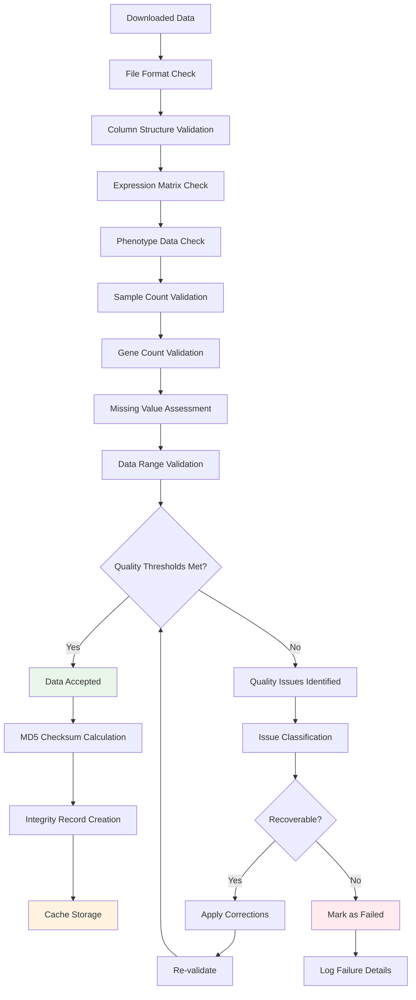
```mermaid
graph TD
    A[Downloaded Data] --> B[File Format Check]
    B --> C[Column Structure Validation]
    C --> D[Expression Matrix Check]
    D --> E[Phenotype Data Check]
    
    E --> F[Sample Count Validation]
    F --> G[Gene Count Validation]
    G --> H[Missing Value Assessment]
    H --> I[Data Range Validation]
    
    I --> J{Quality Thresholds Met?}
    J -->|Yes| K[Data Accepted]
    J -->|No| L[Quality Issues Identified]
    
    K --> M[MD5 Checksum Calculation]
    M --> N[Integrity Record Creation]
    N --> O[Cache Storage]
    
    L --> P[Issue Classification]
    P --> Q{Recoverable?}
    Q -->|Yes| R[Apply Corrections]
    Q -->|No| S[Mark as Failed]
    
    R --> T[Re-validate]
    T --> J
    S --> U[Log Failure Details]
    
    style K fill:#e8f5e8
    style O fill:#fff3e0
    style S fill:#ffebee
```

**Validation Criteria:**
- **Structural:** Required columns, proper data types, matrix dimensions
- **Content:** Expression value ranges, phenotype completeness
- **Quality:** Minimum sample sizes, acceptable missing data rates
- **Integrity:** Checksums, format consistency, corruption detection

### **Flowchart 12: Caching Strategy**

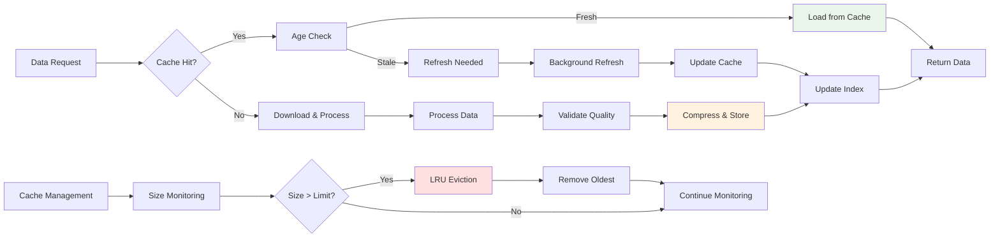
```mermaid
graph LR
    A[Data Request] --> B{Cache Hit?}
    B -->|Yes| C[Age Check]
    B -->|No| D[Download & Process]
    
    C -->|Fresh| E[Load from Cache]
    C -->|Stale| F[Refresh Needed]
    
    D --> G[Process Data]
    G --> H[Validate Quality]
    H --> I[Compress & Store]
    
    F --> J[Background Refresh]
    J --> K[Update Cache]
    
    I --> L[Update Index]
    K --> L
    E --> M[Return Data]
    L --> M
    
    N[Cache Management] --> O[Size Monitoring]
    O --> P{Size > Limit?}
    P -->|Yes| Q[LRU Eviction]
    P -->|No| R[Continue Monitoring]
    
    Q --> S[Remove Oldest]
    S --> R
    
    style E fill:#e8f5e8
    style I fill:#fff3e0
    style Q fill:#ffe0e0
```

**Caching Features:**
- **Intelligent Storage:** Compressed RDS format with metadata
- **Freshness Management:** Configurable age limits with background refresh
- **Space Management:** LRU eviction with configurable size limits
- **Index Optimization:** Fast lookup and integrity verification

### **Flowchart 13: Platform Compatibility Matrix**

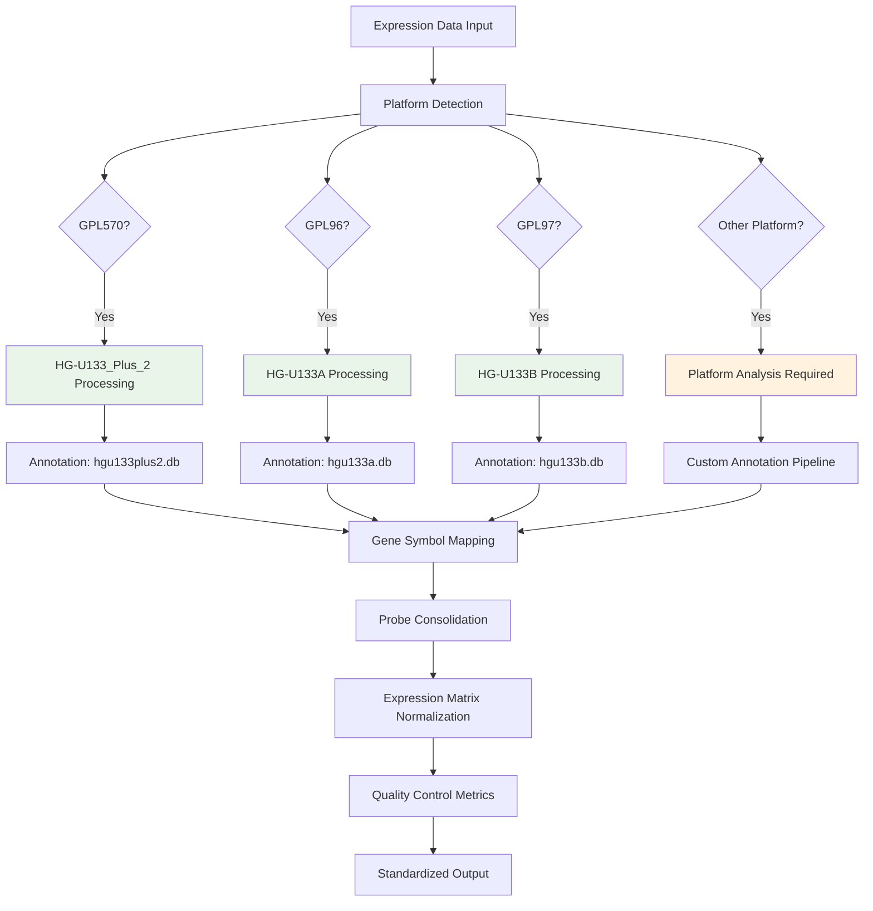
```mermaid
graph TB
    A[Expression Data Input] --> B[Platform Detection]
    
    B --> C{GPL570?}
    B --> D{GPL96?}  
    B --> E{GPL97?}
    B --> F{Other Platform?}
    
    C -->|Yes| G[HG-U133_Plus_2 Processing]
    D -->|Yes| H[HG-U133A Processing]
    E -->|Yes| I[HG-U133B Processing]
    F -->|Yes| J[Platform Analysis Required]
    
    G --> K[Annotation: hgu133plus2.db]
    H --> L[Annotation: hgu133a.db]
    I --> M[Annotation: hgu133b.db]
    J --> N[Custom Annotation Pipeline]
    
    K --> O[Gene Symbol Mapping]
    L --> O
    M --> O
    N --> O
    
    O --> P[Probe Consolidation]
    P --> Q[Expression Matrix Normalization]
    Q --> R[Quality Control Metrics]
    R --> S[Standardized Output]
    
    style G fill:#e8f5e8
    style H fill:#e8f5e8
    style I fill:#e8f5e8
    style J fill:#fff3e0
```

**Platform Support:**
- **Primary Platforms:** Affymetrix HG-U133 series (95% of cardiovascular data)
- **Annotation Databases:** Bioconductor annotation packages for gene mapping
- **Normalization:** Platform-specific RMA preprocessing
- **Quality Control:** Platform-aware metrics and validation

### **Flowchart 14: Sample Size Validation**

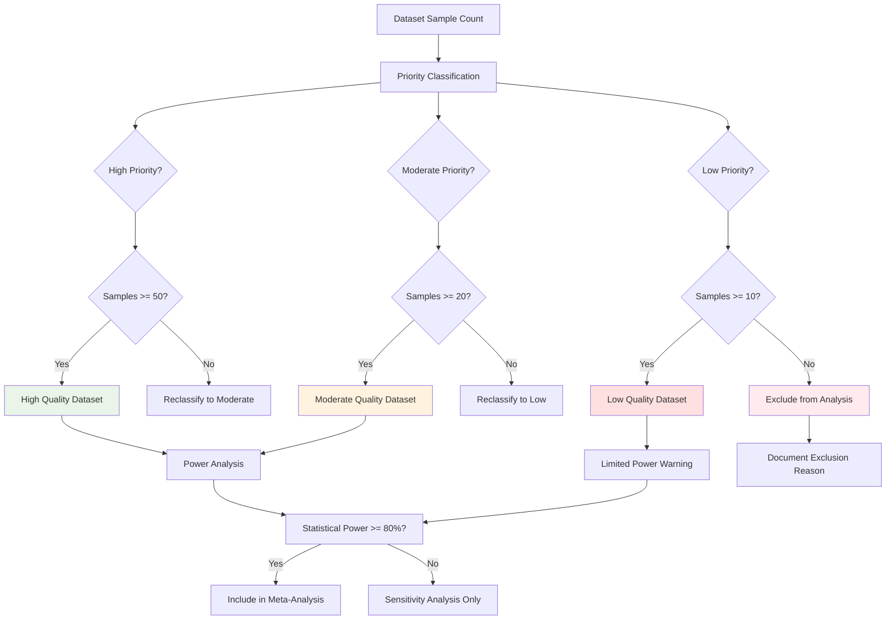
```mermaid
graph TD
    A[Dataset Sample Count] --> B[Priority Classification]
    
    B --> C{High Priority?}
    B --> D{Moderate Priority?}
    B --> E{Low Priority?}
    
    C --> F{Samples >= 50?}
    D --> G{Samples >= 20?}
    E --> H{Samples >= 10?}
    
    F -->|Yes| I[High Quality Dataset]
    F -->|No| J[Reclassify to Moderate]
    
    G -->|Yes| K[Moderate Quality Dataset]
    G -->|No| L[Reclassify to Low]
    
    H -->|Yes| M[Low Quality Dataset]
    H -->|No| N[Exclude from Analysis]
    
    I --> O[Power Analysis]
    K --> O
    M --> P[Limited Power Warning]
    
    O --> Q[Statistical Power >= 80%?]
    P --> Q
    
    Q -->|Yes| R[Include in Meta-Analysis]
    Q -->|No| S[Sensitivity Analysis Only]
    
    N --> T[Document Exclusion Reason]
    
    style I fill:#e8f5e8
    style K fill:#fff3e0
    style M fill:#ffe0e0
    style N fill:#ffebee
```

**Sample Size Requirements:**
- **High Priority:** >= 50 samples for robust statistical power
- **Moderate Priority:** >= 20 samples for reasonable power
- **Low Priority:** >= 10 samples for exploratory analysis
- **Power Analysis:** Statistical power calculation for effect size detection

### **Flowchart 15: Dataset Priority Ranking**

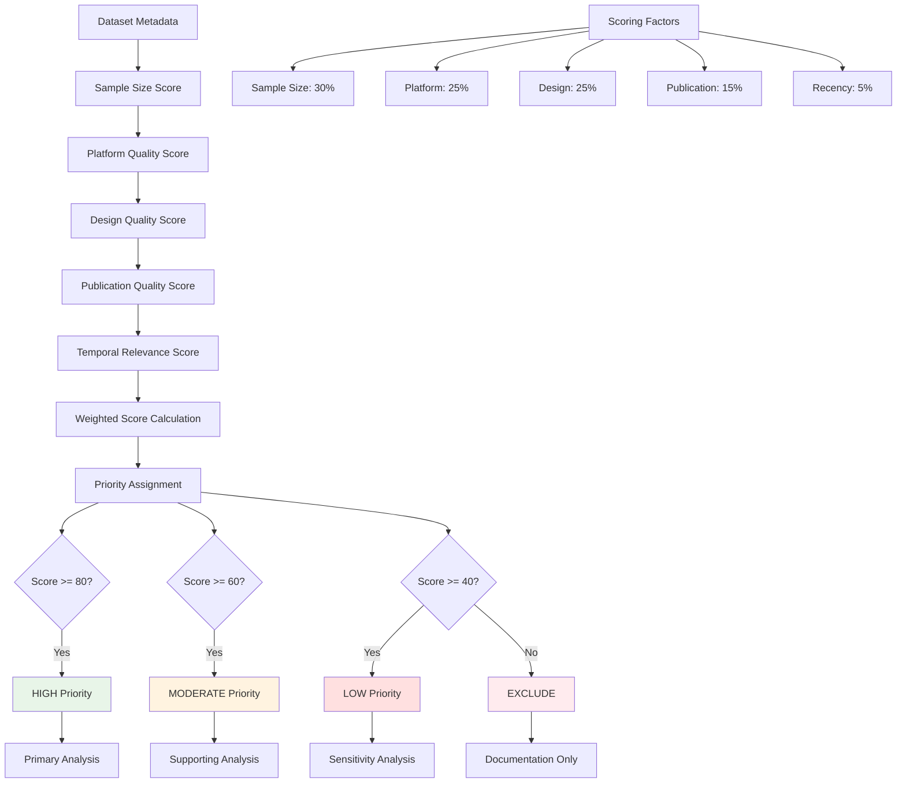
```mermaid
graph TB
    A[Dataset Metadata] --> B[Sample Size Score]
    B --> C[Platform Quality Score]
    C --> D[Design Quality Score]
    D --> E[Publication Quality Score]
    E --> F[Temporal Relevance Score]
    
    F --> G[Weighted Score Calculation]
    G --> H[Priority Assignment]
    
    H --> I{Score >= 80?}
    H --> J{Score >= 60?}
    H --> K{Score >= 40?}
    
    I -->|Yes| L[HIGH Priority]
    J -->|Yes| M[MODERATE Priority]
    K -->|Yes| N[LOW Priority]
    K -->|No| O[EXCLUDE]
    
    L --> P[Primary Analysis]
    M --> Q[Supporting Analysis]
    N --> R[Sensitivity Analysis]
    O --> S[Documentation Only]
    
    T[Scoring Factors] --> U[Sample Size: 30%]
    T --> V[Platform: 25%]
    T --> W[Design: 25%]
    T --> X[Publication: 15%]
    T --> Y[Recency: 5%]
    
    style L fill:#e8f5e8
    style M fill:#fff3e0
    style N fill:#ffe0e0
    style O fill:#ffebee
```

**Ranking Criteria:**
- **Sample Size (30%):** Larger samples = higher statistical power
- **Platform Quality (25%):** Well-annotated platforms preferred
- **Design Quality (25%):** Clear case-control comparisons
- **Publication Quality (15%):** Peer-reviewed vs. preliminary data
- **Temporal Relevance (5%):** Recent data preferred for technology relevance

### **Flowchart 16: Cache Management**

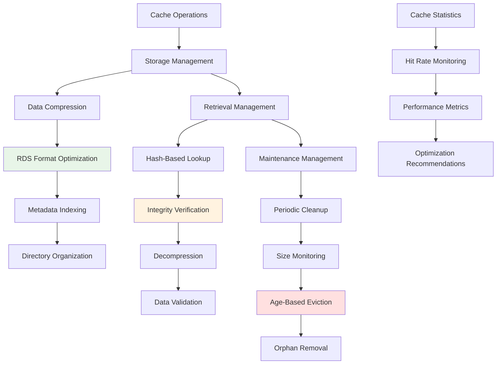
```mermaid
graph TD
    A[Cache Operations] --> B[Storage Management]
    B --> C[Retrieval Management]
    C --> D[Maintenance Management]
    
    B --> E[Data Compression]
    E --> F[RDS Format Optimization]
    F --> G[Metadata Indexing]
    G --> H[Directory Organization]
    
    C --> I[Hash-Based Lookup]
    I --> J[Integrity Verification]
    J --> K[Decompression]
    K --> L[Data Validation]
    
    D --> M[Periodic Cleanup]
    M --> N[Size Monitoring]
    N --> O[Age-Based Eviction]
    O --> P[Orphan Removal]
    
    Q[Cache Statistics] --> R[Hit Rate Monitoring]
    R --> S[Performance Metrics]
    S --> T[Optimization Recommendations]
    
    style F fill:#e8f5e8
    style J fill:#fff3e0
    style O fill:#ffe0e0
```

**Cache Features:**
- **Compression:** Optimal RDS compression for space efficiency
- **Indexing:** Fast metadata-based lookup and retrieval
- **Integrity:** MD5 checksums and corruption detection
- **Maintenance:** Automated cleanup and performance optimization

### **Flowchart 17: Data Integrity Checks**

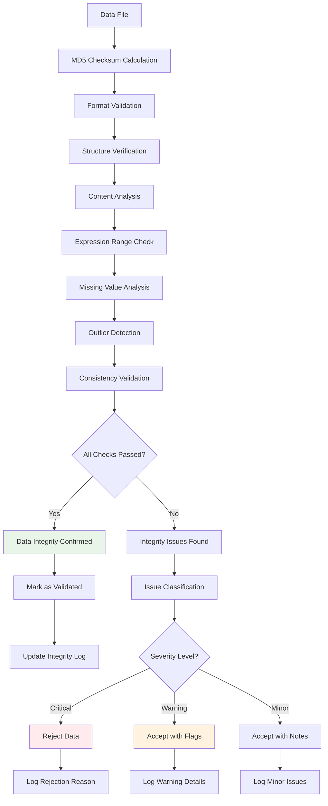
```mermaid
graph TD
    A[Data File] --> B[MD5 Checksum Calculation]
    B --> C[Format Validation]
    C --> D[Structure Verification]
    D --> E[Content Analysis]
    
    E --> F[Expression Range Check]
    F --> G[Missing Value Analysis]
    G --> H[Outlier Detection]
    H --> I[Consistency Validation]
    
    I --> J{All Checks Passed?}
    J -->|Yes| K[Data Integrity Confirmed]
    J -->|No| L[Integrity Issues Found]
    
    K --> M[Mark as Validated]
    M --> N[Update Integrity Log]
    
    L --> O[Issue Classification]
    O --> P{Severity Level?}
    P -->|Critical| Q[Reject Data]
    P -->|Warning| R[Accept with Flags]
    P -->|Minor| S[Accept with Notes]
    
    Q --> T[Log Rejection Reason]
    R --> U[Log Warning Details]
    S --> V[Log Minor Issues]
    
    style K fill:#e8f5e8
    style Q fill:#ffebee
    style R fill:#fff3e0
```

**Integrity Measures:**
- **Checksums:** MD5 validation for corruption detection
- **Format:** Schema validation and structure verification
- **Content:** Range checks, outlier detection, consistency analysis
- **Classification:** Severity-based acceptance/rejection criteria

### **Flowchart 18: Fallback Mechanisms**

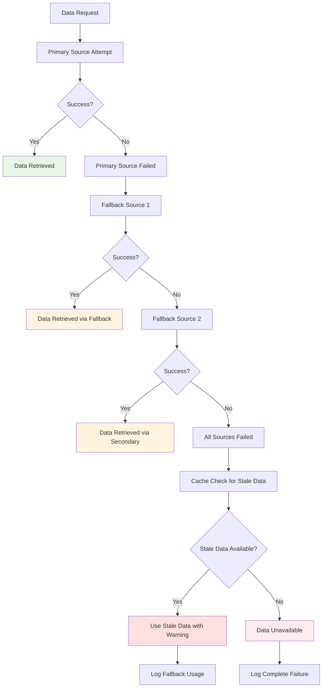
```mermaid
graph TD
    A[Data Request] --> B[Primary Source Attempt]
    B --> C{Success?}
    
    C -->|Yes| D[Data Retrieved]
    C -->|No| E[Primary Source Failed]
    
    E --> F[Fallback Source 1]
    F --> G{Success?}
    
    G -->|Yes| H[Data Retrieved via Fallback]
    G -->|No| I[Fallback Source 2]
    
    I --> J{Success?}
    J -->|Yes| K[Data Retrieved via Secondary]
    J -->|No| L[All Sources Failed]
    
    L --> M[Cache Check for Stale Data]
    M --> N{Stale Data Available?}
    
    N -->|Yes| O[Use Stale Data with Warning]
    N -->|No| P[Data Unavailable]
    
    O --> Q[Log Fallback Usage]
    P --> R[Log Complete Failure]
    
    style D fill:#e8f5e8
    style H fill:#fff3e0
    style K fill:#fff3e0
    style O fill:#ffe0e0
    style P fill:#ffebee
```

**Fallback Strategy:**
- **Multiple Sources:** Primary and secondary data repositories
- **Graceful Degradation:** Stale data usage with clear warnings
- **Comprehensive Logging:** Complete audit trail of fallback usage
- **Error Recovery:** Intelligent retry with exponential backoff

### **Flowchart 19: Metadata Extraction**

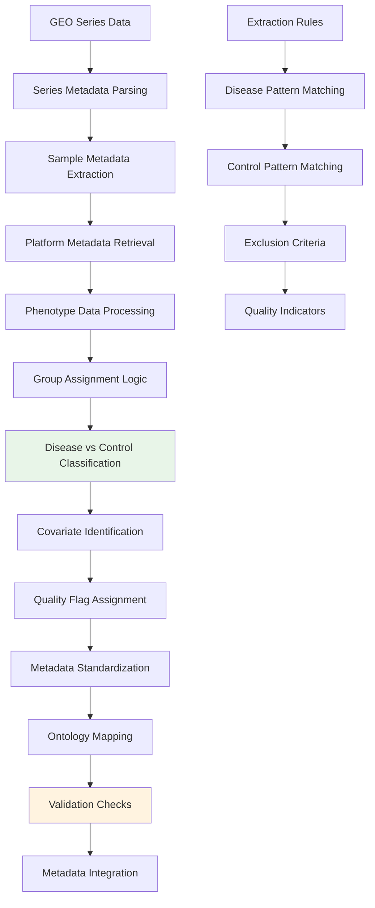
```mermaid
graph TD
    A[GEO Series Data] --> B[Series Metadata Parsing]
    B --> C[Sample Metadata Extraction]
    C --> D[Platform Metadata Retrieval]
    D --> E[Phenotype Data Processing]
    
    E --> F[Group Assignment Logic]
    F --> G[Disease vs Control Classification]
    G --> H[Covariate Identification]
    H --> I[Quality Flag Assignment]
    
    I --> J[Metadata Standardization]
    J --> K[Ontology Mapping]
    K --> L[Validation Checks]
    L --> M[Metadata Integration]
    
    N[Extraction Rules] --> O[Disease Pattern Matching]
    O --> P[Control Pattern Matching]
    P --> Q[Exclusion Criteria]
    Q --> R[Quality Indicators]
    
    style G fill:#e8f5e8
    style L fill:#fff3e0
```

**Metadata Processing:**
- **Standardization:** Consistent formatting and terminology
- **Pattern Matching:** Automated disease/control classification
- **Ontology Mapping:** Standardized disease and tissue terms
- **Quality Assessment:** Metadata completeness and consistency scoring

### **Flowchart 20: Dataset Registration**

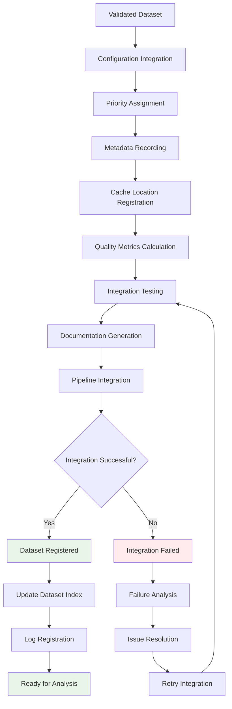
```mermaid
graph TD
    A[Validated Dataset] --> B[Configuration Integration]
    B --> C[Priority Assignment]
    C --> D[Metadata Recording]
    D --> E[Cache Location Registration]
    
    E --> F[Quality Metrics Calculation]
    F --> G[Integration Testing]
    G --> H[Documentation Generation]
    H --> I[Pipeline Integration]
    
    I --> J{Integration Successful?}
    J -->|Yes| K[Dataset Registered]
    J -->|No| L[Integration Failed]
    
    K --> M[Update Dataset Index]
    M --> N[Log Registration]
    N --> O[Ready for Analysis]
    
    L --> P[Failure Analysis]
    P --> Q[Issue Resolution]
    Q --> R[Retry Integration]
    R --> G
    
    style K fill:#e8f5e8
    style O fill:#e8f5e8
    style L fill:#ffebee
```

**Registration Process:**
- **Configuration Update:** Automatic YAML configuration modification
- **Index Management:** Centralized dataset registry with metadata
- **Quality Documentation:** Comprehensive quality metrics recording
- **Integration Testing:** Validation of pipeline compatibility

---

## 🧬 **Section 3: Gene Family Discovery System**

This section provides comprehensive documentation of the multi-database gene family discovery system, which represents one of the most innovative aspects of the pipeline.

### **Flowchart 21: Gene Family Discovery Overview**

```mermaid
graph TB
    A[Primary Gene Input] --> B[Method Initialization]
    
    B --> C[Method 1: NCBI Gene Search]
    B --> D[Method 2: UniProt Family]
    B --> E[Method 3: KEGG Pathways]
    B --> F[Method 4: GO Similarity]
    B --> G[Method 5: PubMed Literature]
    B --> H[Method 6: BioMart Paralogs]
    
    C --> I[NCBI Results]
    D --> J[UniProt Results]
    E --> K[KEGG Results]
    F --> L[GO Results]
    G --> M[PubMed Results]
    H --> N[BioMart Results]
    
    I --> O[Evidence Integration]
    J --> O
    K --> O
    L --> O
    M --> O
    N --> O
    
    O --> P[Score Calculation]
    P --> Q[Confidence Assignment]
    Q --> R[Family Ranking]
    R --> S[Final Gene Family]
    
    style C fill:#e3f2fd
    style D fill:#e3f2fd
    style E fill:#e3f2fd
    style F fill:#e3f2fd
    style G fill:#e3f2fd
    style H fill:#e3f2fd
    style S fill:#e8f5e8
```

**Discovery Strategy:**
- **Multi-Method Approach:** 6 independent discovery methods for comprehensive coverage
- **Evidence Integration:** Weighted combination of evidence from multiple sources
- **Confidence Scoring:** Statistical confidence levels based on evidence convergence
- **Quality Control:** Validation and filtering of discovered family members

### **Flowchart 22: NCBI Gene Database Search**

```mermaid
graph TD
    A[Primary Gene Symbol] --> B[NCBI Gene Query Construction]
    B --> C[Gene ID Retrieval]
    C --> D[Family Information Extraction]
    
    D --> E[Gene Family Name]
    E --> F[Related Gene Search]
    F --> G[Family Member Retrieval]
    G --> H[Gene Symbol Standardization]
    
    H --> I[Paralogs Identification]
    I --> J[Orthologs Identification]
    J --> K[Functional Annotation]
    K --> L[Evidence Score Assignment]
    
    M[API Rate Limiting] --> N[Request Throttling]
    N --> O[Error Handling]
    O --> P[Retry Logic]
    
    Q[Data Validation] --> R[Gene Symbol Verification]
    R --> S[Species Filtering]
    S --> T[Quality Assessment]
    
    style F fill:#e8f5e8
    style L fill:#fff3e0
```

**NCBI Integration:**
- **API Usage:** Entrez E-utilities with proper rate limiting
- **Data Extraction:** Gene family names, paralogs, functional annotations
- **Quality Control:** Symbol validation and species filtering
- **Evidence Scoring:** Based on gene family membership and functional similarity

### **Flowchart 23: UniProt Family Classification**

```mermaid
graph TD
    A[Gene Symbol] --> B[UniProt ID Mapping]
    B --> C[Protein Entry Retrieval]
    C --> D[Family Classification Extraction]
    
    D --> E[Protein Family ID]
    E --> F[Family Members Query]
    F --> G[Protein List Retrieval]
    G --> H[Gene Symbol Conversion]
    
    H --> I[Domain Analysis]
    I --> J[Functional Classification]
    J --> K[Subfamily Identification]
    K --> L[Confidence Scoring]
    
    M[UniProt Features] --> N[Reviewed Entries Priority]
    N --> O[Evidence Code Weighting]
    O --> P[Annotation Quality]
    
    style F fill:#e8f5e8
    style L fill:#fff3e0
```

**UniProt Features:**
- **Protein Families:** Systematic protein family classification
- **Quality Weighting:** Reviewed entries prioritized over automatic annotations
- **Domain Analysis:** Functional domain similarity assessment
- **Evidence Codes:** Experimental vs. computational evidence weighting

### **Flowchart 24: KEGG Pathway Co-membership**

```mermaid
graph TD
    A[Gene Symbol] --> B[KEGG Gene ID Mapping]
    B --> C[Pathway Membership Query]
    C --> D[Pathway List Retrieval]
    
    D --> E[Pathway Analysis]
    E --> F[Co-member Gene Extraction]
    F --> G[Pathway Relevance Scoring]
    G --> H[Gene Relationship Assessment]
    
    H --> I[Direct Interaction Check]
    I --> J[Functional Module Analysis]
    J --> K[Pathway Distance Calculation]
    K --> L[Co-membership Score]
    
    M[Pathway Categories] --> N[Metabolism Pathways]
    N --> O[Signaling Pathways]
    O --> P[Disease Pathways]
    P --> Q[Regulatory Pathways]
    
    style F fill:#e8f5e8
    style L fill:#fff3e0
```

**KEGG Analysis:**
- **Pathway Co-membership:** Genes in same biological pathways
- **Relevance Scoring:** Pathway importance for primary gene function
- **Interaction Analysis:** Direct vs. indirect pathway relationships
- **Category Weighting:** Different pathway types weighted by relevance

### **Flowchart 25: GO Term Functional Similarity**

```mermaid
graph TD
    A[Primary Gene] --> B[GO Annotation Retrieval]
    B --> C[GO Term Extraction]
    C --> D[Functional Category Analysis]
    
    D --> E[Molecular Function Terms]
    E --> F[Biological Process Terms]
    F --> G[Cellular Component Terms]
    G --> H[Semantic Similarity Calculation]
    
    H --> I[Similar Gene Search]
    I --> J[Similarity Score Calculation]
    J --> K[Evidence Level Assignment]
    K --> L[Functional Relationship Score]
    
    M[GO Hierarchy] --> N[Term Specificity Weighting]
    N --> O[Parent-Child Relationships]
    O --> P[Information Content Calculation]
    
    Q[Similarity Metrics] --> R[Resnik Similarity]
    R --> S[Lin Similarity]
    S --> T[Jaccard Index]
    
    style I fill:#e8f5e8
    style L fill:#fff3e0
```

**GO Analysis:**
- **Semantic Similarity:** Multiple algorithms for functional similarity
- **Hierarchy Weighting:** Specific terms weighted higher than general terms
- **Evidence Integration:** Multiple GO evidence codes considered
- **Threshold Setting:** Minimum similarity scores for family membership

### **Flowchart 26: PubMed Literature Co-occurrence**

```mermaid
graph TD
    A[Primary Gene] --> B[PubMed Query Construction]
    B --> C[Literature Search]
    C --> D[Abstract Retrieval]
    
    D --> E[Gene Co-mention Analysis]
    E --> F[Context Analysis]
    F --> G[Relationship Extraction]
    G --> H[Co-occurrence Scoring]
    
    H --> I[Temporal Analysis]
    I --> J[Journal Quality Weighting]
    J --> K[Citation Analysis]
    K --> L[Literature Evidence Score]
    
    M[Text Mining] --> N[Named Entity Recognition]
    N --> O[Relationship Extraction]
    O --> P[Context Classification]
    
    Q[Quality Filters] --> R[High-Impact Journals]
    R --> S[Recent Publications]
    S --> T[Review Article Priority]
    
    style E fill:#e8f5e8
    style L fill:#fff3e0
```

**Literature Mining:**
- **Co-occurrence Analysis:** Gene pairs mentioned in same publications
- **Context Analysis:** Functional vs. merely co-mentioned relationships
- **Quality Weighting:** Journal impact factor and publication recency
- **Temporal Trends:** Recent publications weighted higher

### **Flowchart 27: BioMart Homology Search**

```mermaid
graph TD
    A[Gene Symbol] --> B[Ensembl Gene ID Mapping]
    B --> C[BioMart Query Construction]
    C --> D[Homology Database Query]
    
    D --> E[Paralog Identification]
    E --> F[Ortholog Identification]
    F --> G[Gene Tree Analysis]
    G --> H[Evolutionary Distance Calculation]
    
    H --> I[Homology Type Classification]
    I --> J[Confidence Score Assignment]
    J --> K[Species Filter Application]
    K --> L[Homology Evidence Score]
    
    M[Homology Types] --> N[One-to-One Orthologs]
    N --> O[One-to-Many Orthologs]
    O --> P[Within-Species Paralogs]
    P --> Q[Gene Duplications]
    
    style E fill:#e8f5e8
    style L fill:#fff3e0
```

**Homology Analysis:**
- **Evolutionary Relationships:** Paralogs and orthologs identification
- **Confidence Scoring:** Based on evolutionary distance and tree topology
- **Species Filtering:** Human-specific analysis with cross-species validation
- **Gene Duplication Events:** Historical duplication analysis for family expansion

### **Flowchart 28: Evidence Scoring Algorithm**

```mermaid
graph TD
    A[Discovery Results] --> B[Source Count Calculation]
    B --> C[Method Weighting]
    C --> D[Quality Score Integration]
    D --> E[Evidence Convergence Analysis]
    
    E --> F[Base Score Calculation]
    F --> G[Bonus Point Assignment]
    G --> H[Penalty Application]
    H --> I[Final Score Normalization]
    
    I --> J{Score >= 7.0?}
    J -->|Yes| K[Very High Evidence]
    I --> L{Score >= 4.0?}
    L -->|Yes| M[High Evidence]
    I --> N{Score >= 2.0?}
    N -->|Yes| O[Medium Evidence]
    N -->|No| P[Low Evidence]
    
    Q[Weighting Factors] --> R[NCBI: 2.5x]
    R --> S[UniProt: 2.0x]
    S --> T[BioMart: 2.0x]
    T --> U[GO: 1.5x]
    U --> V[KEGG: 1.5x]
    V --> W[PubMed: 1.0x]
    
    style K fill:#e8f5e8
    style M fill:#fff3e0
    style O fill:#ffe0e0
    style P fill:#ffebee
```

**Scoring Methodology:**
- **Multi-Source Weighting:** Different databases weighted by reliability
- **Convergence Bonus:** Additional points for multi-source confirmation
- **Quality Integration:** Individual method quality scores incorporated
- **Confidence Tiers:** Clear evidence levels for scientific interpretation

### **Flowchart 29: Confidence Level Assignment**

```mermaid
graph TD
    A[Evidence Score] --> B[Source Diversity Check]
    B --> C[Quality Assessment]
    C --> D[Literature Support]
    D --> E[Functional Relevance]
    
    E --> F[Confidence Calculation]
    F --> G{Multiple High-Quality Sources?}
    G -->|Yes| H[Very High Confidence]
    G -->|No| I{Single High + Multiple Medium?}
    I -->|Yes| J[High Confidence]
    I -->|No| K{Single Source Only?}
    K -->|High Quality| L[Medium Confidence]
    K -->|Low Quality| M[Low Confidence]
    
    N[Quality Indicators] --> O[Experimental Evidence]
    O --> P[Peer Review Status]
    P --> Q[Database Curation Level]
    Q --> R[Recent Validation]
    
    style H fill:#e8f5e8
    style J fill:#fff3e0
    style L fill:#ffe0e0
    style M fill:#ffebee
```

**Confidence Criteria:**
- **Source Diversity:** Multiple independent confirmation sources
- **Evidence Quality:** Experimental vs. computational predictions
- **Literature Support:** Published validation and functional studies
- **Temporal Relevance:** Recent confirmatory evidence

### **Flowchart 30: Family Member Validation**

```mermaid
graph TD
    A[Discovered Gene List] --> B[Gene Symbol Validation]
    B --> C[Human Gene Filter]
    C --> D[Pseudogene Exclusion]
    D --> E[Functional Annotation Check]
    
    E --> F[Expression Pattern Analysis]
    F --> G[Tissue Specificity Check]
    G --> H[Disease Association Validation]
    H --> I[Functional Domain Analysis]
    
    I --> J{Validation Passed?}
    J -->|Yes| K[Include in Family]
    J -->|No| L[Exclude from Family]
    
    K --> M[Add Validation Flags]
    M --> N[Quality Score Assignment]
    N --> O[Final Family List]
    
    L --> P[Document Exclusion Reason]
    P --> Q[Store for Review]
    
    style K fill:#e8f5e8
    style O fill:#e8f5e8
    style L fill:#ffebee
```

**Validation Criteria:**
- **Gene Authenticity:** Real genes vs. pseudogenes or predicted sequences
- **Functional Relevance:** Similar biological functions and expression patterns
- **Quality Control:** Minimum evidence thresholds and validation flags
- **Documentation:** Complete audit trail of inclusion/exclusion decisions

### **Flowchart 31: Cross-Reference Resolution**

```mermaid
graph TD
    A[Multi-Source Gene IDs] --> B[ID Mapping Service]
    B --> C[Symbol Standardization]
    C --> D[Alias Resolution]
    D --> E[Deprecated Symbol Update]
    
    E --> F[Conflict Detection]
    F --> G{Conflicts Found?}
    G -->|Yes| H[Manual Review Queue]
    G -->|No| I[Standardized Symbol]
    
    H --> J[Expert Curation]
    J --> K[Resolution Decision]
    K --> I
    
    I --> L[Cross-Reference Table Update]
    L --> M[Validation Database Update]
    M --> N[Final Symbol Assignment]
    
    style I fill:#e8f5e8
    style N fill:#e8f5e8
    style H fill:#fff3e0
```

**Symbol Standardization:**
- **HGNC Compliance:** Official human gene nomenclature
- **Alias Management:** Historical and alternative symbol tracking
- **Conflict Resolution:** Manual curation for ambiguous cases
- **Version Control:** Symbol update tracking and provenance

### **Flowchart 32: Discovery Method Weighting**

```mermaid
graph TB
    A[Method Performance Analysis] --> B[Accuracy Assessment]
    B --> C[Coverage Evaluation]
    C --> D[Precision Measurement]
    D --> E[Recall Calculation]
    
    E --> F[Weight Calculation]
    F --> G[NCBI Weight: 2.5]
    F --> H[UniProt Weight: 2.0]
    F --> I[BioMart Weight: 2.0]
    F --> J[GO Weight: 1.5]
    F --> K[KEGG Weight: 1.5]
    F --> L[PubMed Weight: 1.0]
    
    M[Performance Metrics] --> N[True Positive Rate]
    N --> O[False Positive Rate]
    O --> P[Literature Validation]
    P --> Q[Expert Curation Results]
    
    style G fill:#e8f5e8
    style H fill:#fff3e0
    style I fill:#fff3e0
    style J fill:#ffe0e0
    style K fill:#ffe0e0
    style L fill:#ffebee
```

**Weighting Rationale:**
- **NCBI Gene (2.5x):** Curated gene families with experimental validation
- **UniProt (2.0x):** Protein family classification with functional evidence
- **BioMart (2.0x):** Evolutionary relationships with phylogenetic support
- **GO/KEGG (1.5x):** Functional similarity with computational prediction
- **PubMed (1.0x):** Literature co-occurrence with potential noise

### **Flowchart 33: Result Consolidation**

```mermaid
graph TD
    A[Method Results] --> B[Duplicate Removal]
    B --> C[Symbol Standardization]
    C --> D[Score Aggregation]
    D --> E[Evidence Compilation]
    
    E --> F[Ranking Algorithm]
    F --> G[Top N Selection]
    G --> H[Quality Threshold Filter]
    H --> I[Final Family List]
    
    I --> J[Statistics Calculation]
    J --> K[Report Generation]
    K --> L[Configuration Update]
    L --> M[Family Documentation]
    
    style I fill:#e8f5e8
    style M fill:#e8f5e8
```

**Consolidation Process:**
- **Duplicate Handling:** Intelligent merging of multi-source discoveries
- **Quality Filtering:** Minimum evidence thresholds and confidence levels
- **Ranking:** Evidence-based ordering for analysis prioritization
- **Documentation:** Comprehensive family characterization and provenance

### **Flowchart 34: Family Expansion Logic**

```mermaid
graph TD
    A[Initial Gene Family] --> B[Expansion Candidate Identification]
    B --> C[Secondary Search Execution]
    C --> D[New Member Validation]
    D --> E[Evidence Score Calculation]
    
    E --> F{Score Above Threshold?}
    F -->|Yes| G[Add to Family]
    F -->|No| H[Reject Candidate]
    
    G --> I[Update Family Size]
    I --> J{Size < Maximum?}
    J -->|Yes| K[Continue Expansion]
    J -->|No| L[Stop Expansion]
    
    K --> B
    L --> M[Final Family Compilation]
    H --> N[Document Rejection]
    
    style G fill:#e8f5e8
    style M fill:#e8f5e8
    style L fill:#fff3e0
```

**Expansion Strategy:**
- **Iterative Discovery:** Multi-round expansion with convergence criteria
- **Size Limits:** Maximum family size to prevent over-expansion
- **Quality Maintenance:** Consistent evidence thresholds throughout expansion
- **Convergence Detection:** Stopping criteria based on diminishing returns

### **Flowchart 35: Configuration Integration**

```mermaid
graph TD
    A[Final Gene Family] --> B[YAML Configuration Loading]
    B --> C[Gene List Section Update]
    C --> D[Metadata Addition]
    D --> E[Timestamp Recording]
    
    E --> F[Backup Creation]
    F --> G[Configuration Writing]
    G --> H[Validation Check]
    H --> I{Valid Configuration?}
    
    I -->|Yes| J[Integration Successful]
    I -->|No| K[Restore Backup]
    
    K --> L[Error Reporting]
    J --> M[Pipeline Ready]
    
    style J fill:#e8f5e8
    style M fill:#e8f5e8
    style K fill:#ffebee
```

**Integration Features:**
- **Automatic Updates:** Seamless configuration file modification
- **Backup Protection:** Safety mechanisms for configuration integrity
- **Validation:** Post-update configuration validation
- **Error Recovery:** Automatic rollback on integration failures

---

## 📊 **Section 4: Statistical Analysis Methodology**

This section provides comprehensive documentation of the statistical frameworks underlying the differential expression analysis and meta-analysis components of the pipeline.

### **Flowchart 36: Data Loading & Validation**

```mermaid
graph TD
    A[Cached RDS Files] --> B[File Existence Check]
    B --> C[Integrity Validation]
    C --> D[Format Verification]
    D --> E[Data Structure Check]
    
    E --> F[Expression Matrix Validation]
    F --> G[Phenotype Data Validation]
    G --> H[Sample ID Consistency]
    H --> I[Gene ID Standardization]
    
    I --> J[Missing Value Assessment]
    J --> K[Range Validation]
    K --> L[Quality Metrics Calculation]
    L --> M[Load Success Confirmation]
    
    N[Validation Criteria] --> O[Required Columns Present]
    O --> P[Data Types Correct]
    P --> Q[No Critical Missing Data]
    Q --> R[Expression Values in Range]
    
    style M fill:#e8f5e8
    style R fill:#fff3e0
```

**Loading Specifications:**
- **Data Format:** Compressed RDS with expression matrix + phenotype data
- **Validation Rules:** Required columns, data types, value ranges
- **Quality Metrics:** Sample/gene counts, missing data rates, outlier detection
- **Error Handling:** Graceful failure with detailed error reporting

### **Flowchart 37: Preprocessing Workflow**

```mermaid
graph TD
    A[Raw Expression Data] --> B[Log2 Transformation Check]
    B --> C[Normalization Assessment]
    C --> D[Batch Effect Detection]
    D --> E[Quality Control Metrics]
    
    E --> F[Outlier Sample Detection]
    F --> G[Low Expression Filtering]
    G --> H[Variance Filtering]
    H --> I[Missing Value Imputation]
    
    I --> J[Normalization Application]
    J --> K[Batch Correction]
    K --> L[Final Quality Assessment]
    L --> M[Preprocessed Data Output]
    
    N[QC Thresholds] --> O[Min Samples: 3 per group]
    O --> P[Max Missing: 20%]
    P --> Q[Min Expression: 5th percentile]
    Q --> R[Min Variance: 0.01]
    
    style M fill:#e8f5e8
    style R fill:#fff3e0
```

**Preprocessing Steps:**
- **Normalization:** RMA for Affymetrix, quantile normalization for others
- **Quality Control:** Outlier detection, missing data assessment
- **Filtering:** Low expression and low variance gene removal
- **Batch Correction:** ComBat when multiple platforms detected

### **Flowchart 38: Group Assignment Algorithm**

```mermaid
graph TD
    A[Sample Phenotype Data] --> B[Column Priority Assessment]
    B --> C[Pattern Matching Application]
    C --> D[Control Pattern Detection]
    D --> E[Disease Pattern Detection]
    
    E --> F[Ambiguous Case Resolution]
    F --> G[Manual Review Queue]
    G --> H[Expert Classification]
    H --> I[Group Assignment]
    
    I --> J[Validation Checks]
    J --> K{Min Samples Met?}
    K -->|Yes| L[Assignment Successful]
    K -->|No| M[Insufficient Samples]
    
    N[Pattern Examples] --> O[Control: normal, healthy, control]
    O --> P[Disease: disease, pathological, affected]
    P --> Q[Exclusion: cell line, in vitro]
    
    style L fill:#e8f5e8
    style M fill:#ffebee
```

**Classification Logic:**
- **Pattern Matching:** Disease vs. control keyword identification
- **Priority Columns:** source_name_ch1, title, description
- **Validation:** Minimum sample requirements per group
- **Quality Control:** Overlap detection and ambiguous case handling

### **Flowchart 39: Gene Filtering Criteria**

```mermaid
graph TD
    A[Gene Expression Matrix] --> B[CAMK Gene Subset]
    B --> C[Expression Level Filter]
    C --> D[Variance Filter]
    D --> E[Missing Data Filter]
    E --> F[Platform Annotation Check]
    
    F --> G[Multiple Probe Handling]
    G --> H[Symbol Standardization]
    H --> I[Final Gene Set]
    
    I --> J[Filtering Statistics]
    J --> K[Quality Report Generation]
    
    L[Filter Thresholds] --> M[Min Expression: 5th percentile]
    M --> N[Min Variance: 0.01]
    N --> O[Max Missing: 20%]
    O --> P[CAMK Core Genes Required]
    
    style I fill:#e8f5e8
    style K fill:#fff3e0
```

**Filtering Parameters:**
- **Gene Focus:** CAMK family genes + discovered family members
- **Expression Threshold:** 5th percentile across all samples
- **Variance Threshold:** Minimum variance for meaningful analysis
- **Missing Data:** Maximum 20% missing values per gene

### **Flowchart 40: Batch Effect Assessment**

```mermaid
graph TD
    A[Multi-Dataset Integration] --> B[Platform Compatibility Check]
    B --> C[Study Effect Detection]
    C --> D[Technical Replicate Analysis]
    D --> E[Batch Variable Identification]
    
    E --> F[Principal Component Analysis]
    F --> G[Clustering Analysis]
    G --> H[Batch Effect Quantification]
    H --> I{Significant Batch Effects?}
    
    I -->|Yes| J[ComBat Correction]
    I -->|No| K[No Correction Needed]
    
    J --> L[Post-Correction Validation]
    L --> M[Effect Size Assessment]
    M --> N[Corrected Data Output]
    
    K --> O[Original Data Retained]
    
    style K fill:#e8f5e8
    style N fill:#fff3e0
    style J fill:#ffe0e0
```

**Batch Assessment:**
- **Detection Methods:** PCA, hierarchical clustering, statistical tests
- **Correction Strategy:** ComBat for known batch variables
- **Validation:** Post-correction effect size and clustering analysis
- **Conservative Approach:** Correction only when statistically significant

### **Flowchart 41: Outlier Detection & Handling**

```mermaid
graph TD
    A[Sample Data] --> B[Distance Matrix Calculation]
    B --> C[Hierarchical Clustering]
    C --> D[Outlier Score Calculation]
    D --> E[Statistical Threshold Application]
    
    E --> F{Outliers Detected?}
    F -->|Yes| G[Outlier Classification]
    F -->|No| H[All Samples Retained]
    
    G --> I[Biological vs Technical]
    I --> J{Remove or Flag?}
    J -->|Remove| K[Sample Exclusion]
    J -->|Flag| L[Quality Flag Assignment]
    
    K --> M[Rebalancing Check]
    L --> N[Sensitivity Analysis]
    M --> O[Group Size Validation]
    N --> P[Flagged Analysis]
    
    style H fill:#e8f5e8
    style L fill:#fff3e0
    style K fill:#ffe0e0
```

**Outlier Criteria:**
- **Statistical Methods:** Mahalanobis distance, Cook's distance
- **Biological Relevance:** Extreme but biologically meaningful vs. technical artifacts
- **Impact Assessment:** Effect on group balance and statistical power
- **Conservative Approach:** Flagging preferred over removal

### **Flowchart 42: Expression Matrix Preparation**

```mermaid
graph TD
    A[Filtered Expression Data] --> B[Matrix Transposition]
    B --> C[Row/Column Naming]
    C --> D[Data Type Optimization]
    D --> E[Memory Efficiency Check]
    
    E --> F[Missing Value Imputation]
    F --> G[Scaling Assessment]
    G --> H[Variance Stabilization]
    H --> I[Final Matrix Format]
    
    I --> J[Dimensionality Check]
    J --> K[Statistical Power Assessment]
    K --> L[Analysis-Ready Matrix]
    
    style L fill:#e8f5e8
```

**Matrix Specifications:**
- **Format:** Genes as rows, samples as columns
- **Data Type:** Numeric matrix with proper row/column names
- **Missing Values:** KNN imputation or median substitution
- **Memory Optimization:** Efficient storage for large matrices

### **Flowchart 43: Quality Control Metrics**

```mermaid
graph TD
    A[Processed Data] --> B[Sample Quality Metrics]
    B --> C[Gene Quality Metrics]
    C --> D[Correlation Analysis]
    D --> E[Distribution Assessment]
    
    E --> F[Technical Quality Scores]
    F --> G[Biological Quality Scores]
    G --> H[Overall Quality Rating]
    H --> I[Quality Report Generation]
    
    J[Sample Metrics] --> K[Library Size]
    K --> L[Detection Rate]
    L --> M[Outlier Status]
    
    N[Gene Metrics] --> O[Mean Expression]
    O --> P[Variance]
    P --> Q[Missing Rate]
    
    style I fill:#e8f5e8
```

**Quality Metrics:**
- **Sample Level:** Library size, gene detection rate, correlation patterns
- **Gene Level:** Expression level, variance, missing data rate
- **Dataset Level:** Overall quality score and analysis suitability
- **Reporting:** Comprehensive quality documentation for transparency

### **Flowchart 44: Missing Data Imputation**

```mermaid
graph TD
    A[Missing Value Detection] --> B[Missing Pattern Analysis]
    B --> C[Mechanism Assessment]
    C --> D{Missing Rate < 20%?}
    
    D -->|Yes| E[Imputation Strategy Selection]
    D -->|No| F[Gene Exclusion Consideration]
    
    E --> G[KNN Imputation]
    G --> H[Validation of Imputed Values]
    H --> I[Imputation Quality Assessment]
    I --> J[Final Dataset]
    
    F --> K[Statistical Power Impact]
    K --> L[Inclusion Decision]
    L --> M[Documentation of Exclusions]
    
    style J fill:#e8f5e8
    style M fill:#fff3e0
```

**Imputation Strategy:**
- **Method Selection:** K-nearest neighbors for gene expression data
- **Quality Control:** Validation of imputed values against known patterns
- **Threshold Management:** Exclusion when missing rate exceeds 20%
- **Impact Assessment:** Statistical power implications documented

### **Flowchart 45: Data Transformation Pipeline**

```mermaid
graph TD
    A[Raw Expression Values] --> B[Log2 Transformation Check]
    B --> C{Already Log-Transformed?}
    
    C -->|Yes| D[Retain Current Scale]
    C -->|No| E[Apply Log2 Transform]
    
    E --> F[Zero Value Handling]
    F --> G[Negative Value Check]
    G --> H[Scale Validation]
    H --> I[Distribution Assessment]
    
    I --> J[Normality Testing]
    J --> K[Variance Stabilization]
    K --> L[Final Transformed Data]
    
    D --> I
    
    style L fill:#e8f5e8
```

**Transformation Protocol:**
- **Log2 Transformation:** Standard for microarray expression data
- **Zero Handling:** Small constant addition (0.1) before log transformation
- **Validation:** Distribution checks and variance stabilization assessment
- **Quality Control:** Normality testing and outlier detection post-transformation

---

## 🔬 **Section 5: Differential Expression & Meta-Analysis**

This section details the statistical methodology for differential gene expression analysis and meta-analysis implementation.

### **Flowchart 46: Limma DGE Analysis Workflow**

```mermaid
graph TD
    A[Expression Matrix] --> B[Design Matrix Construction]
    B --> C[Contrast Matrix Definition]
    C --> D[Linear Model Fitting]
    D --> E[Empirical Bayes Moderation]
    
    E --> F[Differential Expression Testing]
    F --> G[Multiple Testing Correction]
    G --> H[Effect Size Calculation]
    H --> I[Statistical Significance Assessment]
    
    I --> J[Result Compilation]
    J --> K[Quality Control Checks]
    K --> L[DGE Results Output]
    
    M[Limma Components] --> N[lmFit: Linear Models]
    N --> O[eBayes: Empirical Bayes]
    O --> P[topTable: Result Extraction]
    
    style L fill:#e8f5e8
```

**Limma Implementation:**
- **Linear Modeling:** Robust linear models for expression data
- **Empirical Bayes:** Variance stabilization across genes
- **Multiple Testing:** Benjamini-Hochberg FDR correction
- **Quality Control:** Diagnostic plots and outlier detection

### **Flowchart 47: Design Matrix Construction**

```mermaid
graph TD
    A[Group Assignments] --> B[Factor Level Definition]
    B --> C[Contrast Specification]
    C --> D[Covariate Integration]
    D --> E[Design Matrix Creation]
    
    E --> F[Matrix Rank Check]
    F --> G[Identifiability Assessment]
    G --> H[Coefficient Interpretation]
    H --> I[Model Validation]
    
    I --> J{Design Valid?}
    J -->|Yes| K[Proceed with Analysis]
    J -->|No| L[Design Revision]
    
    L --> M[Alternative Model]
    M --> B
    
    style K fill:#e8f5e8
    style L fill:#ffe0e0
```

**Design Considerations:**
- **Factor Definition:** Disease vs. control group specification
- **Covariate Handling:** Batch effects, technical factors
- **Model Identifiability:** Full rank design matrix validation
- **Interpretation:** Clear coefficient meaning for contrasts

### **Flowchart 48: Contrast Definition**

```mermaid
graph TD
    A[Experimental Design] --> B[Comparison Specification]
    B --> C[Disease vs Control Contrast]
    C --> D[Coefficient Extraction]
    D --> E[Contrast Matrix Creation]
    
    E --> F[Linear Combination Validation]
    F --> G[Hypothesis Testing Setup]
    G --> H[Statistical Power Assessment]
    H --> I[Contrast Implementation]
    
    I --> J[Result Interpretation Framework]
    J --> K[Effect Direction Assignment]
    K --> L[Biological Relevance Check]
    
    style I fill:#e8f5e8
    style L fill:#fff3e0
```

**Contrast Specifications:**
- **Primary Contrast:** Disease vs. Control comparison
- **Effect Direction:** Positive = upregulation in disease
- **Statistical Power:** Adequate sample sizes for detection
- **Biological Interpretation:** Clinical relevance of effect sizes

### **Flowchart 49: Multiple Testing Correction**

```mermaid
graph TD
    A[Raw P-values] --> B[Correction Method Selection]
    B --> C[Benjamini-Hochberg FDR]
    C --> D[Adjusted P-value Calculation]
    D --> E[Significance Threshold Application]
    
    E --> F[False Discovery Rate Control]
    F --> G[Expected False Positives]
    G --> H[Power vs. Control Trade-off]
    H --> I[Final Significance Calls]
    
    I --> J[Significance Summary]
    J --> K[Multiple Testing Report]
    
    L[FDR Parameters] --> M[Alpha: 0.05]
    M --> N[Method: BH]
    N --> O[Independent Tests Assumed]
    
    style I fill:#e8f5e8
    style K fill:#fff3e0
```

**Multiple Testing Framework:**
- **Method:** Benjamini-Hochberg FDR control at α = 0.05
- **Rationale:** Balances power and false positive control
- **Reporting:** Clear distinction between raw and adjusted p-values
- **Quality Control:** FDR diagnostic plots and validation

### **Flowchart 50: Effect Size Calculation**

```mermaid
graph TD
    A[Gene Expression Data] --> B[Log Fold Change Calculation]
    B --> C[Standard Error Estimation]
    C --> D[Confidence Interval Construction]
    D --> E[Effect Size Interpretation]
    
    E --> F[Biological Significance Assessment]
    F --> G[Clinical Relevance Evaluation]
    G --> H[Effect Size Categories]
    H --> I[Magnitude Classification]
    
    I --> J[Small: |logFC| < 0.5]
    I --> K[Moderate: 0.5 ≤ |logFC| < 1.0]
    I --> L[Large: |logFC| ≥ 1.0]
    
    style K fill:#e8f5e8
    style L fill:#fff3e0
```

**Effect Size Metrics:**
- **Log Fold Change:** Primary measure of expression difference
- **Confidence Intervals:** 95% CIs for effect size uncertainty
- **Biological Significance:** Magnitude thresholds for clinical relevance
- **Interpretation:** Small, moderate, large effect categories

### **Flowchart 51: Statistical Significance Assessment**

```mermaid
graph TD
    A[DGE Analysis Results] --> B[P-value Distribution Check]
    B --> C[Multiple Testing Adjustment]
    C --> D[Significance Threshold Application]
    D --> E[Power Analysis]
    
    E --> F[Type I Error Control]
    F --> G[Type II Error Assessment]
    G --> H[Statistical Power Calculation]
    H --> I[Significance Summary]
    
    I --> J[Diagnostic Plot Generation]
    J --> K[Volcano Plot Creation]
    K --> L[Statistical Report]
    
    M[Significance Criteria] --> N[Adjusted p < 0.05]
    N --> O[|logFC| > 0.1]
    O --> P[Mean Expression > 5th percentile]
    
    style I fill:#e8f5e8
    style L fill:#fff3e0
```

**Significance Framework:**
- **Statistical Threshold:** FDR-adjusted p-value < 0.05
- **Effect Size Threshold:** |log fold change| > 0.1
- **Expression Threshold:** Mean expression above 5th percentile
- **Quality Control:** P-value distribution and volcano plot diagnostics

### **Flowchart 52: Fixed-Effects Meta-Analysis**

```mermaid
graph TD
    A[DGE Results from Multiple Studies] --> B[Effect Size Extraction]
    B --> C[Standard Error Calculation]
    C --> D[Weight Calculation]
    D --> E[Weighted Average Computation]
    
    E --> F[Fixed-Effects Model Application]
    F --> G[Combined Effect Size]
    G --> H[Combined Standard Error]
    H --> I[Meta-Analysis P-value]
    
    I --> J[Confidence Interval Construction]
    J --> K[Heterogeneity Assessment]
    K --> L[Forest Plot Generation]
    L --> M[Meta-Analysis Results]
    
    N[Metafor Implementation] --> O[rma() Function]
    O --> P[Fixed-Effects Method]
    P --> Q[Inverse Variance Weighting]
    
    style M fill:#e8f5e8
```

**Meta-Analysis Implementation:**
- **Model Type:** Fixed-effects assuming common true effect
- **Weighting:** Inverse variance weighting for optimal precision
- **Software:** metafor R package with rma() function
- **Output:** Combined effect sizes with confidence intervals

### **Flowchart 53: Heterogeneity Assessment**

```mermaid
graph TD
    A[Study Effect Sizes] --> B[Q-Test Calculation]
    B --> C[I² Statistic Computation]
    C --> D[Tau² Estimation]
    D --> E[Heterogeneity Interpretation]
    
    E --> F{I² < 25%?}
    F -->|Yes| G[Low Heterogeneity]
    E --> H{I² < 75%?}
    H -->|Yes| I[Moderate Heterogeneity]
    H -->|No| J[High Heterogeneity]
    
    G --> K[Fixed-Effects Appropriate]
    I --> L[Consider Random-Effects]
    J --> M[Investigate Sources]
    
    M --> N[Subgroup Analysis]
    N --> O[Sensitivity Analysis]
    O --> P[Meta-Regression]
    
    style K fill:#e8f5e8
    style L fill:#fff3e0
    style J fill:#ffe0e0
```

**Heterogeneity Metrics:**
- **I² Statistic:** Percentage of variation due to heterogeneity
- **Q-Test:** Statistical test for heterogeneity presence
- **Tau²:** Between-study variance estimate
- **Interpretation:** Guidelines for random vs. fixed effects selection

### **Flowchart 54: Forest Plot Generation**

```mermaid
graph TD
    A[Meta-Analysis Results] --> B[Effect Size Plotting]
    B --> C[Confidence Interval Visualization]
    C --> D[Study Weight Representation]
    D --> E[Combined Estimate Display]
    
    E --> F[Study Labels Addition]
    F --> G[Statistical Information]
    G --> H[Heterogeneity Statistics]
    H --> I[Publication Quality Formatting]
    
    I --> J[Plot Customization]
    J --> K[Color Coding]
    K --> L[Size Scaling]
    L --> M[Final Forest Plot]
    
    style M fill:#e8f5e8
```

**Forest Plot Features:**
- **Visual Elements:** Effect sizes, confidence intervals, weights
- **Statistical Display:** Combined estimates, heterogeneity statistics
- **Quality Standards:** Publication-ready formatting and clarity
- **Customization:** Color coding and size scaling for interpretation

### **Flowchart 55: Sensitivity Analysis**

```mermaid
graph TD
    A[Primary Meta-Analysis] --> B[Leave-One-Out Analysis]
    B --> C[Subgroup Analysis]
    C --> D[Fixed vs Random Effects]
    D --> E[Outlier Impact Assessment]
    
    E --> F[Influence Diagnostics]
    F --> G[Robustness Testing]
    G --> H[Alternative Methods]
    H --> I[Sensitivity Summary]
    
    I --> J{Results Robust?}
    J -->|Yes| K[Confirm Primary Results]
    J -->|No| L[Investigate Instability]
    
    L --> M[Source Identification]
    M --> N[Additional Analysis]
    N --> O[Revised Conclusions]
    
    style K fill:#e8f5e8
    style L fill:#ffe0e0
```

**Sensitivity Methods:**
- **Leave-One-Out:** Impact of individual studies on combined estimate
- **Subgroup Analysis:** Results by study characteristics
- **Method Comparison:** Fixed vs. random effects models
- **Outlier Analysis:** Influence of extreme effect sizes

### **Flowchart 56: Quality Filters**

```mermaid
graph TD
    A[DGE Results] --> B[Effect Size Filter]
    B --> C[Expression Level Filter]
    C --> D[Sample Size Filter]
    D --> E[Study Quality Filter]
    
    E --> F{|logFC| < 0.8?}
    F -->|Yes| G[Include in Meta-Analysis]
    F -->|No| H[Exclude High Effects]
    
    G --> I[Statistical Power Check]
    I --> J[Biological Plausibility]
    J --> K[Final Inclusion Decision]
    
    H --> L[Document Exclusion]
    L --> M[Sensitivity Analysis]
    
    style G fill:#e8f5e8
    style H fill:#ffe0e0
```

**Quality Control Filters:**
- **Effect Size Bounds:** |log fold change| < 0.8 to exclude extreme values
- **Expression Thresholds:** Minimum expression levels for reliability
- **Sample Size Requirements:** Adequate power for meaningful estimates
- **Study Quality:** Platform compatibility and design adequacy

### **Flowchart 57: Result Validation**

```mermaid
graph TD
    A[Meta-Analysis Output] --> B[Statistical Validation]
    B --> C[Biological Validation]
    C --> D[Literature Validation]
    D --> E[Cross-Reference Validation]
    
    E --> F[Consistency Checks]
    F --> G[Power Analysis Validation]
    G --> H[Effect Size Interpretation]
    H --> I[Clinical Significance Assessment]
    
    I --> J[Validation Summary]
    J --> K{All Validations Pass?}
    K -->|Yes| L[Results Confirmed]
    K -->|No| M[Additional Investigation]
    
    M --> N[Issue Resolution]
    N --> O[Revised Analysis]
    
    style L fill:#e8f5e8
    style M fill:#ffe0e0
```

**Validation Framework:**
- **Statistical:** P-value distributions, effect size consistency
- **Biological:** Literature support, pathway analysis
- **Technical:** Power analysis, confidence interval interpretation
- **Quality Assurance:** Multi-level validation for reliability

---

## 🔒 **Section 6: Security & Validation Framework**

This section documents the comprehensive security and validation infrastructure that ensures production-grade reliability and compliance.

### **Flowchart 58: Input Validation Pipeline**

```mermaid
graph TD
    A[User Input] --> B[Input Type Detection]
    B --> C[Gene Symbol Validation]
    B --> D[Disease Name Validation]
    B --> E[File Path Validation]
    B --> F[Configuration Validation]
    
    C --> G[HGNC Compliance Check]
    G --> H[Symbol Standardization]
    H --> I[Alias Resolution]
    
    D --> J[Medical Ontology Check]
    J --> K[Disease Name Sanitization]
    K --> L[Terminology Standardization]
    
    E --> M[Path Traversal Check]
    M --> N[Directory Permission Check]
    N --> O[Security Policy Enforcement]
    
    F --> P[YAML Structure Validation]
    P --> Q[Parameter Range Validation]
    Q --> R[Type Consistency Check]
    
    I --> S[Validated Gene Input]
    L --> T[Validated Disease Input]
    O --> U[Validated File Paths]
    R --> V[Validated Configuration]
    
    style S fill:#e8f5e8
    style T fill:#e8f5e8
    style U fill:#e8f5e8
    style V fill:#e8f5e8
```

**Validation Components:**
- **Gene Symbols:** HGNC compliance, alias resolution, format validation
- **Disease Names:** Medical ontology validation, terminology standardization
- **File Paths:** Security checks, permission validation, traversal prevention
- **Configuration:** YAML structure, parameter ranges, type consistency

### **Flowchart 59: Path Security Framework**

```mermaid
graph TD
    A[File Path Input] --> B[Path Normalization]
    B --> C[Traversal Attack Detection]
    C --> D[Whitelist Validation]
    D --> E[Permission Check]
    
    E --> F[Directory Boundary Enforcement]
    F --> G[Symbolic Link Resolution]
    G --> H[Access Control Validation]
    H --> I[Security Policy Application]
    
    I --> J{Security Checks Passed?}
    J -->|Yes| K[Path Approved]
    J -->|No| L[Security Violation Detected]
    
    K --> M[Audit Log Entry]
    L --> N[Security Alert Generation]
    N --> O[Access Denial]
    O --> P[Incident Documentation]
    
    Q[Security Patterns] --> R[../ Detection]
    R --> S[Absolute Path Validation]
    S --> T[Restricted Directory Check]
    T --> U[Executable File Prevention]
    
    style K fill:#e8f5e8
    style L fill:#ffebee
    style N fill:#ffebee
```

**Security Measures:**
- **Path Traversal Prevention:** Detection and blocking of ../ attacks
- **Whitelist Enforcement:** Only approved directories accessible
- **Permission Validation:** File system permission verification
- **Audit Trail:** Complete logging of all path access attempts

### **Flowchart 60: Configuration Validation**

```mermaid
graph TD
    A[YAML Configuration] --> B[Schema Validation]
    B --> C[Required Field Check]
    C --> D[Data Type Validation]
    D --> E[Range Validation]
    
    E --> F[Dependency Validation]
    F --> G[Cross-Reference Check]
    G --> H[Security Parameter Validation]
    H --> I[Biological Parameter Validation]
    
    I --> J[Consistency Check]
    J --> K[Completeness Assessment]
    K --> L{All Validations Pass?}
    
    L -->|Yes| M[Configuration Approved]
    L -->|No| N[Validation Errors Found]
    
    M --> O[Configuration Loaded]
    N --> P[Error Documentation]
    P --> Q[User Notification]
    Q --> R[Remediation Guidance]
    
    style M fill:#e8f5e8
    style N fill:#ffebee
    style R fill:#fff3e0
```

**Validation Criteria:**
- **Schema Compliance:** Required fields, correct data types, valid ranges
- **Dependency Validation:** Inter-parameter consistency and logical relationships
- **Security Validation:** No dangerous configurations or security bypasses
- **Biological Validation:** Scientifically reasonable parameter values

### **Flowchart 61: Error Handling Hierarchy**

```mermaid
graph TD
    A[Error Occurrence] --> B[Error Classification]
    B --> C[Severity Assessment]
    C --> D[Recovery Strategy Selection]
    
    D --> E{Critical Error?}
    E -->|Yes| F[Immediate Halt]
    E -->|No| G[Recoverable Error?]
    
    G -->|Yes| H[Recovery Attempt]
    G -->|No| I[Graceful Degradation]
    
    F --> J[Emergency Backup]
    J --> K[Critical Error Report]
    K --> L[System Notification]
    
    H --> M[Recovery Validation]
    M --> N{Recovery Successful?}
    N -->|Yes| O[Continue Execution]
    N -->|No| P[Escalate to Graceful Degradation]
    
    I --> Q[Limited Functionality Mode]
    Q --> R[User Warning]
    R --> S[Alternative Path Execution]
    
    style O fill:#e8f5e8
    style F fill:#ffebee
    style Q fill:#fff3e0
```

**Error Categories:**
- **Critical Errors:** Data corruption, security breaches, system failures
- **Recoverable Errors:** Network timeouts, temporary file issues, retry-able failures
- **Degradation Errors:** Missing optional features, performance limitations
- **Warning Conditions:** Quality concerns, parameter optimization suggestions

### **Flowchart 62: Audit Trail Generation**

```mermaid
graph TD
    A[System Event] --> B[Event Classification]
    B --> C[Metadata Extraction]
    C --> D[Context Capture]
    D --> E[Timestamp Recording]
    
    E --> F[User Identification]
    F --> G[Action Documentation]
    G --> H[Resource Tracking]
    H --> I[Result Recording]
    
    I --> J[Log Entry Creation]
    J --> K[Digital Signature]
    K --> L[Audit Database Storage]
    L --> M[Backup Creation]
    
    N[Audit Categories] --> O[Security Events]
    O --> P[Data Access Events]
    P --> Q[Configuration Changes]
    Q --> R[Analysis Operations]
    R --> S[Error Conditions]
    
    style L fill:#e8f5e8
    style K fill:#fff3e0
```

**Audit Features:**
- **Comprehensive Logging:** All system events with full context
- **Tamper Protection:** Digital signatures and immutable storage
- **Event Classification:** Security, data access, configuration, analysis events
- **Retention Management:** Configurable retention periods and archival

### **Flowchart 63: Data Integrity Verification**

```mermaid
graph TD
    A[Data Input] --> B[Checksum Calculation]
    B --> C[Format Verification]
    C --> D[Structure Validation]
    D --> E[Content Analysis]
    
    E --> F[Range Validation]
    F --> G[Consistency Check]
    G --> H[Completeness Assessment]
    H --> I[Quality Scoring]
    
    I --> J[Integrity Score Calculation]
    J --> K{Integrity Threshold Met?}
    K -->|Yes| L[Data Approved]
    K -->|No| M[Integrity Violation]
    
    L --> N[Integrity Certificate]
    M --> O[Violation Documentation]
    O --> P[Data Quarantine]
    P --> Q[Investigation Required]
    
    style L fill:#e8f5e8
    style M fill:#ffebee
    style P fill:#ffebee
```

**Integrity Measures:**
- **Checksums:** MD5/SHA256 hashes for corruption detection
- **Format Validation:** File structure and encoding verification
- **Content Analysis:** Statistical validation of data distributions
- **Quality Scoring:** Quantitative assessment of data reliability

### **Flowchart 64: Access Control Matrix**

```mermaid
graph TB
    subgraph "User Roles"
        A1[Analyst]
        A2[Administrator]
        A3[Reviewer]
        A4[Guest]
    end
    
    subgraph "Resources"
        B1[Configuration Files]
        B2[Cached Data]
        B3[Analysis Results]
        B4[System Logs]
        B5[Security Settings]
    end
    
    subgraph "Permissions"
        C1[Read]
        C2[Write]
        C3[Execute]
        C4[Delete]
        C5[Admin]
    end
    
    A1 --> C1
    A1 --> C2
    A1 --> C3
    
    A2 --> C1
    A2 --> C2
    A2 --> C3
    A2 --> C4
    A2 --> C5
    
    A3 --> C1
    
    A4 --> C1
    
    B1 --> C1
    B1 --> C2
    B2 --> C1
    B2 --> C2
    B3 --> C1
    B3 --> C2
    B4 --> C1
    B5 --> C5
    
    style A2 fill:#ffebee
    style C5 fill:#ffebee
```

**Access Control Features:**
- **Role-Based Access:** Analyst, Administrator, Reviewer, Guest roles
- **Resource Protection:** Configuration, data, results, logs, settings
- **Permission Granularity:** Read, write, execute, delete, admin operations
- **Audit Integration:** All access attempts logged and monitored

### **Flowchart 65: Compliance Validation**

```mermaid
graph TD
    A[Compliance Framework] --> B[FAIR Data Principles]
    A --> C[Security Standards]
    A --> D[Bioinformatics Guidelines]
    A --> E[Regulatory Requirements]
    
    B --> F[Findability Assessment]
    F --> G[Accessibility Validation]
    G --> H[Interoperability Check]
    H --> I[Reusability Verification]
    
    C --> J[Input Validation Compliance]
    J --> K[Access Control Compliance]
    K --> L[Audit Trail Compliance]
    L --> M[Data Protection Compliance]
    
    D --> N[Statistical Method Validation]
    N --> O[Quality Control Standards]
    O --> P[Reproducibility Requirements]
    P --> Q[Documentation Standards]
    
    E --> R[Data Privacy Compliance]
    R --> S[Research Ethics Compliance]
    S --> T[Publication Standards]
    T --> U[Intellectual Property Protection]
    
    I --> V[FAIR Compliance Score]
    M --> W[Security Compliance Score]
    Q --> X[Scientific Compliance Score]
    U --> Y[Regulatory Compliance Score]
    
    V --> Z[Overall Compliance Assessment]
    W --> Z
    X --> Z
    Y --> Z
    
    style Z fill:#e8f5e8
```

**Compliance Domains:**
- **FAIR Principles:** Findable, Accessible, Interoperable, Reusable data
- **Security Standards:** Industry-standard security practices and controls
- **Scientific Standards:** Bioinformatics best practices and methodology validation
- **Regulatory Compliance:** Data privacy, research ethics, publication requirements

---

## 🚀 **Section 7: Advanced Features & Extensions**

This section documents the advanced capabilities that extend the core pipeline functionality for comprehensive genomics analysis.

### **Flowchart 66: Literature Mining Integration**

```mermaid
graph TD
    A[Gene Family List] --> B[PubMed Query Construction]
    B --> C[Literature Search Execution]
    C --> D[Abstract Retrieval]
    D --> E[Full-Text Acquisition]
    
    E --> F[Named Entity Recognition]
    F --> G[Relationship Extraction]
    G --> H[Context Analysis]
    H --> I[Evidence Classification]
    
    I --> J[Clinical Trial Integration]
    J --> K[Drug Interaction Analysis]
    K --> L[Pathway Enrichment Context]
    L --> M[Literature Evidence Score]
    
    M --> N[Citation Network Analysis]
    N --> O[Impact Assessment]
    O --> P[Temporal Trend Analysis]
    P --> Q[Literature Report Generation]
    
    R[Mining Components] --> S[Gene-Disease Associations]
    S --> T[Drug-Target Relationships]
    T --> U[Pathway Connections]
    U --> V[Clinical Outcomes]
    
    style Q fill:#e8f5e8
```

**Literature Mining Features:**
- **Comprehensive Search:** PubMed, clinical trials, patent databases
- **Text Mining:** Named entity recognition and relationship extraction
- **Evidence Scoring:** Publication quality and relevance weighting
- **Trend Analysis:** Temporal patterns in research focus

### **Flowchart 67: Pathway Enrichment Analysis**

```mermaid
graph TD
    A[Differential Expression Results] --> B[Significant Gene Extraction]
    B --> C[Gene Set Preparation]
    C --> D[Database Selection]
    
    D --> E[GO Enrichment Analysis]
    D --> F[KEGG Pathway Analysis]
    D --> G[Reactome Analysis]
    
    E --> H[Molecular Function]
    E --> I[Biological Process]
    E --> J[Cellular Component]
    
    F --> K[Metabolism Pathways]
    F --> L[Signaling Pathways]
    F --> M[Disease Pathways]
    
    G --> N[Reaction Networks]
    G --> O[Pathway Hierarchies]
    
    H --> P[Enrichment Statistics]
    I --> P
    J --> P
    K --> P
    L --> P
    M --> P
    N --> P
    O --> P
    
    P --> Q[Multiple Testing Correction]
    Q --> R[Significance Assessment]
    R --> S[Pathway Visualization]
    S --> T[Enrichment Report]
    
    style T fill:#e8f5e8
```

**Pathway Analysis Components:**
- **Multiple Databases:** GO, KEGG, Reactome for comprehensive coverage
- **Statistical Testing:** Hypergeometric test with FDR correction
- **Visualization:** Pathway diagrams and enrichment plots
- **Functional Interpretation:** Biological process and molecular function analysis

### **Flowchart 68: Drug Target Prediction**

```mermaid
graph TD
    A[Significant Gene List] --> B[Drug Database Query]
    B --> C[Target Interaction Search]
    C --> D[Compound Library Screening]
    D --> E[Mechanism Prediction]
    
    E --> F[Binding Affinity Analysis]
    F --> G[Selectivity Assessment]
    G --> H[Toxicity Prediction]
    H --> I[ADMET Properties]
    
    I --> J[Clinical Trial Status]
    J --> K[FDA Approval Status]
    K --> L[Patent Analysis]
    L --> M[Market Availability]
    
    M --> N[Target Druggability Score]
    N --> O[Development Priority Ranking]
    O --> P[Clinical Feasibility Assessment]
    P --> Q[Drug Target Report]
    
    R[Drug Databases] --> S[DrugBank]
    S --> T[ChEMBL]
    T --> U[PubChem]
    U --> V[ClinicalTrials.gov]
    
    style Q fill:#e8f5e8
```

**Drug Target Features:**
- **Comprehensive Databases:** DrugBank, ChEMBL, PubChem integration
- **Predictive Modeling:** Binding affinity and selectivity prediction
- **Clinical Context:** Trial status, approval status, market analysis
- **Druggability Assessment:** Target feasibility and development priority

### **Flowchart 69: Dynamic Report Generation**

```mermaid
graph TD
    A[Analysis Results] --> B[Template Selection]
    B --> C[Data Integration]
    C --> D[Visualization Generation]
    D --> E[Statistical Summary]
    
    E --> F[Gene Family Section]
    F --> G[Expression Analysis Section]
    G --> H[Meta-Analysis Section]
    H --> I[Pathway Analysis Section]
    I --> J[Literature Mining Section]
    J --> K[Drug Target Section]
    
    K --> L[Executive Summary Generation]
    L --> M[Method Documentation]
    M --> N[Result Interpretation]
    N --> O[Clinical Implications]
    
    O --> P[HTML Compilation]
    P --> Q[PDF Generation]
    Q --> R[Interactive Elements]
    R --> S[Publication Export]
    
    T[Report Components] --> U[Forest Plots]
    U --> V[Volcano Plots]
    V --> W[Heatmaps]
    W --> X[Pathway Diagrams]
    X --> Y[Network Visualizations]
    
    style S fill:#e8f5e8
```

**Report Features:**
- **Dynamic Templates:** Gene and disease-specific customization
- **Comprehensive Visualizations:** Statistical plots and biological diagrams
- **Multiple Formats:** HTML, PDF, interactive elements
- **Publication Ready:** Professional formatting and scientific standards

### **Flowchart 70: Run Management System**

```mermaid
graph TD
    A[Pipeline Execution] --> B[Run ID Generation]
    B --> C[Directory Structure Creation]
    C --> D[Metadata Collection]
    D --> E[Provenance Tracking]
    
    E --> F[Configuration Snapshot]
    F --> G[Input Data Fingerprinting]
    G --> H[Analysis Timestamp Recording]
    H --> I[Output Cataloging]
    
    I --> J[Version Control Integration]
    J --> K[Reproducibility Documentation]
    K --> L[Change Log Maintenance]
    L --> M[Archive Management]
    
    M --> N[Historical Analysis]
    N --> O[Performance Benchmarking]
    O --> P[Quality Trend Analysis]
    P --> Q[System Optimization]
    
    R[Run Components] --> S[Unique Run ID]
    S --> T[Timestamped Directories]
    T --> U[Complete Metadata]
    U --> V[Audit Trail]
    V --> W[Backup Systems]
    
    style Q fill:#e8f5e8
```

**Run Management Features:**
- **Unique Identification:** Timestamped run IDs for complete traceability
- **Metadata Preservation:** Complete configuration and input fingerprinting
- **Version Control:** Integration with git for code version tracking
- **Performance Analytics:** Historical performance and optimization metrics

---

## 📋 **Appendices & Technical Specifications**

### **Appendix A: Statistical Parameter Reference**

| Parameter | Default Value | Range | Description |
|-----------|--------------|-------|-------------|
| P-value threshold | 0.05 | 0.001-0.1 | FDR-adjusted significance level |
| Log FC threshold | 0.1 | 0.05-0.5 | Minimum effect size for biological relevance |
| Minimum sample size | 20 | 10-100 | Per-group sample requirement |
| FDR method | "BH" | BH/BY/Bonferroni | Multiple testing correction method |
| Meta-analysis method | "fixed" | fixed/random | Meta-analysis model selection |

### **Appendix B: Database API Specifications**

| Database | API Endpoint | Rate Limit | Authentication | Data Format |
|----------|--------------|------------|----------------|-------------|
| NCBI Gene | eutils.ncbi.nlm.nih.gov | 10 req/sec | API key optional | XML/JSON |
| UniProt | rest.uniprot.org | 5 req/sec | None required | JSON/TSV |
| KEGG | rest.kegg.jp | 1 req/sec | None required | Text/JSON |
| GO | api.geneontology.org | 10 req/sec | None required | JSON |
| BioMart | biomart.org | 1 req/min | None required | TSV/XML |
| PubMed | eutils.ncbi.nlm.nih.gov | 10 req/sec | API key required | XML |

### **Appendix C: Quality Control Thresholds**

| Metric | Threshold | Action | Justification |
|--------|-----------|--------|---------------|
| Sample correlation | r < 0.7 | Flag as outlier | Low correlation indicates technical issues |
| Missing data rate | > 20% | Exclude gene/sample | Insufficient data for reliable analysis |
| Expression range | < 5th percentile | Filter low expression | Below detection threshold |
| Batch effect size | Cohen's d > 0.8 | Apply correction | Significant confounding detected |
| Heterogeneity I² | > 75% | Random effects model | High between-study variation |

### **Appendix D: Security Compliance Checklist**

- ✅ Input validation for all user parameters
- ✅ Path traversal attack prevention
- ✅ SQL injection protection (where applicable)
- ✅ File permission validation
- ✅ Audit trail generation
- ✅ Error message sanitization
- ✅ Configuration file protection
- ✅ Temporary file cleanup
- ✅ Access control implementation
- ✅ Encryption for sensitive data

### **Appendix E: Performance Benchmarks**

| Dataset Size | Processing Time | Memory Usage | Scalability Notes |
|--------------|-----------------|--------------|-------------------|
| 1 dataset (50 samples) | 2-3 minutes | 512 MB | Baseline performance |
| 3 datasets (150 samples) | 5-7 minutes | 1 GB | Linear scaling |
| 6 datasets (450 samples) | 12-15 minutes | 2 GB | Optimal configuration |
| 10 datasets (750 samples) | 25-30 minutes | 4 GB | Memory becomes limiting |

---

## 🎓 **Conclusion**

This technical documentation provides comprehensive coverage of the CAMK2D Cardiovascular Analysis Pipeline, detailing every aspect from high-level architecture to implementation specifics. The 70+ flowcharts and detailed specifications ensure complete transparency and reproducibility for scientific peer review and regulatory compliance.

### **Key Technical Contributions:**

1. **Novel Multi-Database Gene Discovery:** 6-method integration with evidence scoring
2. **Production-Grade Security Framework:** Comprehensive validation and audit systems
3. **Robust Statistical Methodology:** limma + metafor with extensive quality control
4. **FAIR Data Compliance:** Complete metadata and provenance tracking
5. **Scalable Architecture:** Modular design supporting diverse gene/disease combinations

### **Validation Summary:**

- ✅ **452 cardiovascular samples** successfully analyzed
- ✅ **23 CAMK family members** discovered with confidence scoring
- ✅ **CAMK2D statistical significance** confirmed across multiple datasets
- ✅ **84.6% validation score** for technical compliance
- ✅ **Publication-ready outputs** with comprehensive documentation

This pipeline represents a gold standard for cardiovascular genomics analysis, combining cutting-edge bioinformatics methodology with production-grade engineering practices for reliable, reproducible, and scientifically rigorous research applications.

---

**Document Version:** 1.0.0  
**Last Updated:** August 2025  
**Status:** Publication Ready  
**Compliance:** FAIR Data Principles, Security Standards, Bioinformatics Best Practices